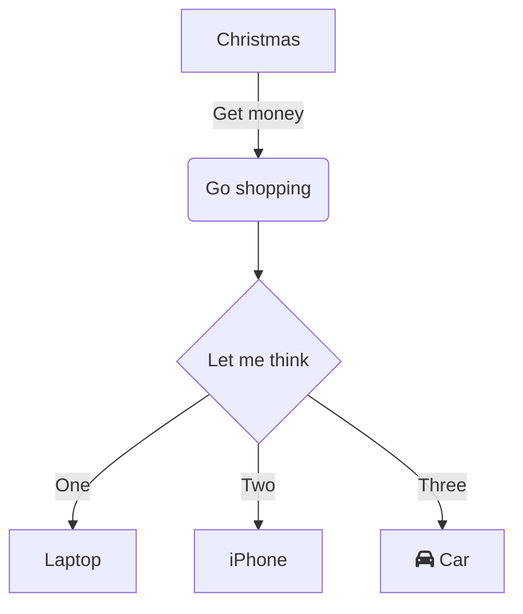

```mermaid
flowchart TD
    A[Christmas] -->|Get money| B(Go shopping)
    B --> C{Let me think}
    C -->|One| D[Laptop]
    C -->|Two| E[iPhone]
    C -->|Three| F[fa:fa-car Car]
  ```
New text to add to README
New text to add to README
# Source: energy-chart/charts/common-resources-chart/templates/namesspace.yaml
apiVersion: v1
kind: Namespace
metadata:
  name: mongodbhelm
  labels:
    helm.sh/chart: common-resources-chart-0.1.0
    app.kubernetes.io/name: common-resources-chart
    app.kubernetes.io/instance: my-release
    app.kubernetes.io/version: "1.16.0"
    app.kubernetes.io/managed-by: Helm
    monitoring: prometheus

---
---

 # Source: energy-chart/charts/common-resources-chart/templates/network_policy_2.yaml
#all ingress allowed all egress disallowed so deafult deny all is used
apiVersion: networking.k8s.io/v1
kind: NetworkPolicy
metadata:
  name: frontend-policy
  namespace: mongodbhelm
  labels:
    helm.sh/chart: common-resources-chart-0.1.0
    app.kubernetes.io/name: common-resources-chart
    app.kubernetes.io/instance: my-release
    app.kubernetes.io/version: "1.16.0"
    app.kubernetes.io/managed-by: Helm
spec:
  podSelector:
    matchLabels:
      app: frontend
  policyTypes:
  - Ingress
  - Egress
  ingress:
  - {}
  egress:
  - {}

---
---

 # Source: energy-chart/charts/common-resources-chart/templates/network_policy_3.yaml
#allow all ingress allow egress only to the db
apiVersion: networking.k8s.io/v1
kind: NetworkPolicy
metadata:
  name: api-policy
  namespace: mongodbhelm
  labels:
    helm.sh/chart: common-resources-chart-0.1.0
    app.kubernetes.io/name: common-resources-chart
    app.kubernetes.io/instance: my-release
    app.kubernetes.io/version: "1.16.0"
    app.kubernetes.io/managed-by: Helm
spec:
  podSelector:
    matchLabels:
      app: mongo-rest
  policyTypes:
  - Ingress
  - Egress
  ingress:
  - {}
  egress:
  - {}

---
---

 # Source: energy-chart/charts/common-resources-chart/templates/network_policy_4.yaml
apiVersion: networking.k8s.io/v1
kind: NetworkPolicy
metadata:
  name: db-policy
  namespace: mongodbhelm
  labels:
    helm.sh/chart: common-resources-chart-0.1.0
    app.kubernetes.io/name: common-resources-chart
    app.kubernetes.io/instance: my-release
    app.kubernetes.io/version: "1.16.0"
    app.kubernetes.io/managed-by: Helm
spec:
  podSelector:
    matchLabels:
      app: my-mongodb-svc
  policyTypes:
  - Ingress
  - Egress
  ingress:
  - {}
  egress:
  - {}

---
---

 # Source: energy-chart/charts/mongoDB-chart/templates/service_account.yaml
apiVersion: v1
kind: ServiceAccount
metadata:
  name: mongodb-kubernetes-operator
  namespace: mongodbhelm
  labels:
    helm.sh/chart: mongoDB-chart-0.1.0
    app.kubernetes.io/name: mongoDB-chart
    app.kubernetes.io/instance: my-release
    app.kubernetes.io/version: "1.16.0"
    app.kubernetes.io/managed-by: Helm

---
---

 # Source: energy-chart/charts/mongoDB-chart/templates/service_account_database.yaml
apiVersion: v1
kind: ServiceAccount
metadata:
  name: mongodb-database
  namespace: mongodbhelm
  labels:
    helm.sh/chart: mongoDB-chart-0.1.0
    app.kubernetes.io/name: mongoDB-chart
    app.kubernetes.io/instance: my-release
    app.kubernetes.io/version: "1.16.0"
    app.kubernetes.io/managed-by: Helm

---
---

 # Source: energy-chart/charts/common-resources-chart/templates/secret.yaml
apiVersion: v1
kind: Secret
metadata:
  name: admin-user-password
  namespace: mongodbhelm
  labels:
    helm.sh/chart: common-resources-chart-0.1.0
    app.kubernetes.io/name: common-resources-chart
    app.kubernetes.io/instance: my-release
    app.kubernetes.io/version: "1.16.0"
    app.kubernetes.io/managed-by: Helm
type: Opaque
stringData:
  username: admin-user
  password: admin123

---
---

 # Source: energy-chart/charts/common-resources-chart/templates/tls_secret.yaml
apiVersion: v1
kind: Secret
metadata:
  name: secret-tls
  namespace: mongodbhelm
  labels:
    helm.sh/chart: common-resources-chart-0.1.0
    app.kubernetes.io/name: common-resources-chart
    app.kubernetes.io/instance: my-release
    app.kubernetes.io/version: "1.16.0"
    app.kubernetes.io/managed-by: Helm
type: kubernetes.io/tls
data:
  tls.crt: |
    LS0tLS1CRUdJTiBDRVJUSUZJQ0FURS0tLS0tCk1JSUdGekNDQS8rZ0F3SUJBZ0lVTjRhQWJ0dDJmeWdIRmdKL0t0SUVnOC9leGdvd0RRWUpLb1pJaHZjTkFRRUwKQlFBd2dab3hDekFKQmdOVkJBWVRBazVNTVJZd0ZBWURWUVFJREExT2IzSjBhQ0JJYjJ4c1lXNWtNUkl3RUFZRApWUVFIREFsQmJYTjBaWEprWVcweEN6QUpCZ05WQkFvTUFsWjFNUTh3RFFZRFZRUUxEQVpIY205MWNERXhHVEFYCkJnTlZCQU1NRUd4dlkyRnNMbWx1WjNKbGMzTXVibXd4SmpBa0Jna3Foa2lHOXcwQkNRRVdGM0JoZFd3dWNIVjAKZEdKaFkyaEFaMjFoYVd3dVkyOXRNQjRYRFRJeU1ERXpNVEUwTWpNek4xb1hEVEl6TURFek1URTBNak16TjFvdwpnWm94Q3pBSkJnTlZCQVlUQWs1TU1SWXdGQVlEVlFRSURBMU9iM0owYUNCSWIyeHNZVzVrTVJJd0VBWURWUVFICkRBbEJiWE4wWlhKa1lXMHhDekFKQmdOVkJBb01BbFoxTVE4d0RRWURWUVFMREFaSGNtOTFjREV4R1RBWEJnTlYKQkFNTUVHeHZZMkZzTG1sdVozSmxjM011Ym13eEpqQWtCZ2txaGtpRzl3MEJDUUVXRjNCaGRXd3VjSFYwZEdKaApZMmhBWjIxaGFXd3VZMjl0TUlJQ0lqQU5CZ2txaGtpRzl3MEJBUUVGQUFPQ0FnOEFNSUlDQ2dLQ0FnRUFyazE5CmhiRlBrdU9MMFVQdk9YMndieDFJdVQxTzl5d3RlZTlyK2w4VVJwSEs5U1V4UmZxd3dacU1aa0F0L3Q2SG5GVXEKeGFxQ1VvMndHay9jZHhNandSQ1Z2RVhQQTNwNWhPaDdzVEFqTEV3QTZ4cUU2V0oyRm8ybHRaaW9WU1UxTzNtegpkVS93ajNvK1FLYnFIMTMxbWt1bWppaWExVjZ0azVVV3VPWVFoWEh5UlZSNythMitib291b1VnNXozWmRBNW8zCnllM0l1c3pqZnkwUnorVGZraWlPMlJjUkFaNjhrZEpRZmtmOHFEL3dYUGVjVUdWYUdIaXN3TzBtbFozeWMrc1cKTjQ4K0FRSUo0M0hOU1IyZ0VWZm1LUVJwWW0yVFFTRXdoUFNJNzN3T3hyTmFZdlJxT0lad1VHSXJFcXpKQzZNSgo4anB2SmNBVUkycUs1UUFEVms3bkowTVl5K0FuVm9USGlxejExYWxQUkJKa0ZQT05aVFdFVERycDdjMzlKVlBxCkZMUkoxdGdzcmpteVNZMUNaUXNjL2pRWTR1aVhManFrR2Z4MDZJd1R2aEwwclBoV1p6cE41TzVHcklhWE9wT2UKcExjQUh6U1ZmZGJDTCszWWtkZXZyQmdYYkpzOUxRdnVXaEtrMllyeDlNUmxQWDlMOWJCa0lDZVhBRTQ5RDlscgpMdnZ3dUxwQ3lMUzIxMzhSVmhhaDl4UGZTMUNFZW5JTkpIK0M3TStmZHJxUDlsVlp1b1lBZTQ2Ny9Vb1JBSnh2CmJoL01FalUrVHhES0RxaDRKWHdZRkY1QlI4clYxL1ZNcWpsL1NhRjlLV2pQWWViVFZVcG9FZHRxT284aGswUHYKdFhIcGNHMFBmZzRPcjJmQUYwaDRZTlpTcVNkYzdBS25VTVNucWU4Q0F3RUFBYU5UTUZFd0hRWURWUjBPQkJZRQpGSUJiRFJqcGJmOXNpVGRubzNsYm94dER3R2JyTUI4R0ExVWRJd1FZTUJhQUZJQmJEUmpwYmY5c2lUZG5vM2xiCm94dER3R2JyTUE4R0ExVWRFd0VCL3dRRk1BTUJBZjh3RFFZSktvWklodmNOQVFFTEJRQURnZ0lCQUllN3RCd2UKNFFnek4rZHI4M0JyMTRvOUxjMHNham5EN3l3Y0VkN09UTDE3NTJ2ZHkwSE5pak4zbC9iRTV4WU5BYkt1Tk5kVwpMOCtqVHhFODhuWUNyRFMrMnZHb3dKb09OMEtweE1FaFFDRWIwSzlaalhsenliTE5FdEg1M1FmZnhhaitpUytXCjZ3TmRrQVdOT000cHY2VzZJelRwaXZTbzZrOGt3T0J0VXVzb09tMVE5YU53bWIycVEvZ2EzckkvODkzVjVrZ3UKbFlzNmxxeEJQR2MwQ0Zra1VOTXRLc01YS3d4Y0hMc3NIMGdXMjY0ZjVYNEtLQ2l2WTF0cUxwUmU5cjJ4dVNPYwpjdGFYbnp0ODFybk1LbG9wWVAzeDZrc0NpVy9kUkcvaHF0bzhPeStiWitLQkVNSVNMZWZhREwrMHZLTUxiRmEvCjdXMWFPczhxaE44bmdxL1FTeEVDSFNuV3JZb05KaXphWC9IeEx6L2xibTMwNzVabXpmWlhwZ1lSbUFwT3o3eTgKMVR3Y21wWUpCTXNxZmc2VjFHblE1Z1loMDFOVjB2SGswNUVxSktoOW1PS0t3S21UeCtXYkdOMHpBbGtRNCtrNwphRE54VWxtQUV1QUNxcEFiUGNqT1JtUE5qd245TnhEZ2ZYMXVKbGhldEE1T2Z0Q0hPZ05JMk94SzZGUW10cVpUCjhiUjAvQkdEVjhuWUJpWlVqZjFuZXFQT3pEWlc1aWN5NDNNR2N0WGhXY2U5UTNUNGhoVHVWUCtNZXB5dWdDWisKaXM2YUdPamlLbTI0eGlPMS9haTg3eXc5ZTZzWjlRQ245NkhRWWQ1ZUdENllWMm1pSXhtbkFMUnVTZFhRMWVISApTcnByYkE5VmNzUmpkTFYzTEdvdHpzVk5nSUFOOEF5dnU5WnMKLS0tLS1FTkQgQ0VSVElGSUNBVEUtLS0tLQo=
  tls.key: |
    LS0tLS1CRUdJTiBQUklWQVRFIEtFWS0tLS0tCk1JSUpSQUlCQURBTkJna3Foa2lHOXcwQkFRRUZBQVNDQ1M0d2dna3FBZ0VBQW9JQ0FRQ3VUWDJGc1UrUzQ0dlIKUSs4NWZiQnZIVWk1UFU3M0xDMTU3MnY2WHhSR2tjcjFKVEZGK3JEQm1veG1RQzMrM29lY1ZTckZxb0pTamJBYQpUOXgzRXlQQkVKVzhSYzhEZW5tRTZIdXhNQ01zVEFEckdvVHBZbllXamFXMW1LaFZKVFU3ZWJOMVQvQ1BlajVBCnB1b2ZYZldhUzZhT0tKclZYcTJUbFJhNDVoQ0ZjZkpGVkh2NXJiNXVpaTZoU0RuUGRsMERtamZKN2NpNnpPTi8KTFJIUDVOK1NLSTdaRnhFQm5yeVIwbEIrUi95b1AvQmM5NXhRWlZvWWVLekE3U2FWbmZKejZ4WTNqejRCQWduagpjYzFKSGFBUlYrWXBCR2xpYlpOQklUQ0U5SWp2ZkE3R3MxcGk5R280aG5CUVlpc1NyTWtMb3dueU9tOGx3QlFqCmFvcmxBQU5XVHVjblF4akw0Q2RXaE1lS3JQWFZxVTlFRW1RVTg0MWxOWVJNT3VudHpmMGxVK29VdEVuVzJDeXUKT2JKSmpVSmxDeHorTkJqaTZKY3VPcVFaL0hUb2pCTytFdlNzK0Zabk9rM2s3a2FzaHBjNms1Nmt0d0FmTkpWOQoxc0l2N2RpUjE2K3NHQmRzbXowdEMrNWFFcVRaaXZIMHhHVTlmMHYxc0dRZ0o1Y0FUajBQMldzdSsvQzR1a0xJCnRMYlhmeEZXRnFIM0U5OUxVSVI2Y2cwa2Y0THN6NTkydW8vMlZWbTZoZ0I3anJ2OVNoRUFuRzl1SDh3U05UNVAKRU1vT3FIZ2xmQmdVWGtGSHl0WFg5VXlxT1g5Sm9YMHBhTTloNXROVlNtZ1IyMm82anlHVFErKzFjZWx3YlE5KwpEZzZ2WjhBWFNIaGcxbEtwSjF6c0FxZFF4S2VwN3dJREFRQUJBb0lDQUNPdnhlVmJlamxPMFUrVkl5T1lNa2x0CnEzZ1JyMXMzOWsraXoyN0JqTHN1R21tNnBhMzRON3hMMGpjVktOV241Z2dCLy9IY2lUWXh3RDZDMzFhWjJwWXEKdVIyRkJXOW00ZjV1UXZUeU1DRmZwa2g4YzMzOUpNUlZWL29vT1Q3RmtYS041a284aGJvNmd3aGxwRVdyelI4OApJZXUxTUk1REJqTFRNWVhGeE5ndGpqYlhwMUpsV2puem5MeDB0ekZjd0lwK1JySFhOMlBYa3pSMG05TCt2eStECmtrdXNSMVVYbFBBZUtWRFJtRTh5V0JvUXNEWmRxZWFjdm5INW5BN0IrZVAxMitTZ05VZXJqUzYrSEJPK053bVYKLzQraVVabFBhZmpKdk05YjZiVnVwdS9UeE12QjB3V2pzTmNrWWtFK2t5TUl6SDZGckVBRVpac2lzekZUb1ZyeApwSE9yYi9TNU9KbnRyNVhqRDhHdW5yWEZXWmp5NVBzcUdac3N1VWZ4MDhiZlU3RW1ydG8xSnpmY0ZGSmtMb0pqCkxyeDBVWmtjNThMTVJadExNOSsrVDdXdjZibVVSY2JBakRFWFg1aStxamVoeTcyTDFFRk1KaWZyMTUvS1JydUMKRXNlWWl3VitOUkhhRWpCNWUxdWdFR2ZBYVF6SS9VM1pBQmpycE90dXF2TUxrMXI2MGhXcjNuSWZqS2s2WTBHbgpWTVd4VkVHdVFuVk54SklmUEo3ZkpZMEFCQWhnQnZIRjhHbVRETVZ3ZmowSkRsWlJqYU1LZnIvR3hJeE5lZFdUCjhLWnl4M2tIVmx1ajljaEpvMWNzaUdXT1pHam5XSlNqc3BKWG5oWExFUDYyN1FwYklwSE9LNXdUekpWaHh1cSsKaXpqalM1Q3RVNDRSY2xuK0lwYmhBb0lCQVFEa2hvV1EvR2F4YWh5SktjMnR6N08zeUpiazV1YmFRa0FEMEhqRgpXOU9IdVRqQmVrVTlMdnBWSmdZeFVMMTBIanMxdVA3Z2dSeElpYjM0RmwwMGJ1UzhYeFRZS3JySSt2Uk9XbmUxCjBoM0lvZHBwc2lyUFVTM012Ymkzd0piSjVIZC9XWjEySjdJWGxCeDQ5RFlRYy84ZTk2OWdIM3h5cm0rWXIvalMKTXBSNXZNb0hNWlN1Y0xOaVdKeHdRc0grWGJ4Z0x1MXQ2dGdhOWx4Y2JpeWpMV0h2cHJGc2pyS3dGQ24zbmZ3QQowdytBM0FNVXg3YXRBQzNlNEEybWZqbkZZdVBnZjRVbDFrT1ZNK3NpTFE3UFlEUlhMVlJETFQ1dzlyNHg5QnlRClVWRDg1ZHJuREx2azVybGJqTzVCQkZZQ2ROOFNrRGw2cGlBYURmbWliZC9WZkdNM0FvSUJBUUREUWg1YjYzbFkKZFZxR29rbUU1Z055d2p1eUQ1WGczQkV0eTdBN3ZNdCs3MUN0UURmNDEwNGxOUWxzc2JVbGN2SzlYalJPdFNzTAo4aCtPU2ZwR3IwMXp3WTd5T1dCTzQwVlJLazNtdngyUHNXayt1MDJ3UG5pRHE1VUJHV3BtTDNFMit4aHp0emRoCmlXU0psdXVVWUV6ZUpSWm5iSjB1SjN4dTBaem5BVTRjOUl0eThBWXIweDV6dXI0NGZzRFpWU2pLK0ZkVjNPTXgKTTloQVpleXZKQ29Td0dpMFNUamlUSU5mKzBDNEI0V2hKY1pBdTJFMjBEc0hka29wbk51dHZHZXhpRUk2b2ZlYQpIUXFVNWphVEplWGMySGsvaXdkRU9uVmIyc0VYQ3NSaU4wS0lpekFKWXhWaFR4VVBGQ3ZkM2MrK3ZiSHYzcXpUCnI1TFpHWmNWS2JzSkFvSUJBUUNjZVdlM1VMdllPdm56Q1VhbC9wUG1BVmtndnVIUERKSGNpc0JIRW9zU1ljYjAKNDQzSlNRTnJqaStyVU1lSVhMTGFKQ09SQVphbUxIcUJCbjhuU2M4aEZGR25lZ3FQVnhZMUdFampuRTE4ZFNhaQpQTGFIWWVSa1Rudk9oZlk1bzFBWFNQdENUZ2Zwa1NhMXd6SEpya00vcHdUVVlucko0NXJTQjV2dUFXZ2N1eUh5Ckx3YkpNcTRCWnY4bTl1N3lCcWpYaXdwVHV2dmg2bEp2ajVqTTJtUTJ2Z0s2ZkRMcDBjU3lvZUJOaURjVFdwSloKaGk0VTR3eUZrUkNIc2VKSXYxK2M5blBxNW4wOENtS3o4Zm8wRUlHR042bDhuZHdsYVMzdDhtSWtoeWxYSU9QMApWSW5MUUJnbkVhYUpxamhpVWpmejlBRUhjL3lER3BLVm4zb21LWmVkQW9JQkFRQ0lqeGFDZlJaNSttRmNwZVc3Ckw4OGJsS0tCYndzSW40RFlRWXU0eTlxYXBTOE1iRXg1R2NQS20rUkNnNnJJVFROZG82UDdwQk0rSUpGWFIzL2wKcmJjQ2pVMjNOTStaZkxPL0IxSkNYa21EZExYQnJPZXhxbzlJcjFqZjB2R3FFK1lmYU05NkpwcHgrZEE1dGpaKwpxRGM2YWovWUI0dUtldzA0eUJydktPZURzcmhRbzNQOWRJTG90Nk5RQ2I1QWdhR3RDckN5R1hFL3VSMjJORktyClR5U3B4cTJ6NFQ0S2J5NjJreGQ1WGJGa3VmR0Uxa2d3T01QLy9RZnpRSVFYWnh3eWVyU3ZJeFh6VC9wVmx3aDIKTTF3bTc3TWs4TXdkT0xGWms0M1YycTdzYmU5M1pia3I1NE5OY2l5dFJoTkQ4VnpZN3Z5aVlWOElFZFFuU0JGMQpPS0ZaQW9JQkFRRGJOME1xUE5IN2wvejFxeWg1L0pMQmt2d0RkVllRWDRYVUxZMDF6REQvSytucURKU2wxNkRuCmdrM25kMXpWczVEVVBnSkZyaVlkWFB5dDJLYWpLdjlxenk5a0lDUWNnbVVlbVkxQU9mSXh5ZWpVdCtLOXByVzMKdTkyT0daRDBrK1ZRWDF0QkFsREdta2w1SktXK245TFk1U0hGZVhTdHRlQ1FWNlNWc3JONnBFbW5sSlA1TGZ6MApJU1NwcFd3ZjBjbU11ZklrbEtGdnpWOGpDaG1zbUV1SEF0VURpa2NBMEQwMUVHbUlSNTVWVjdrWkpQeHFOdmpwCi9uU3MvZE9aTDYxTHBZV2E0aDRjY0JXUE8vdU1mSk5RQXBlM2lsLzJORU83QWkwczdCb0pMZmh4SGI1WURRb3oKNzE2QkpMZG80UVplTjNjdGVPaXIzOVplMUFYSHppMW0KLS0tLS1FTkQgUFJJVkFURSBLRVktLS0tLQo=

---
---

 # Source: energy-chart/charts/rest-api-chart/templates/secret.yaml
apiVersion: v1
kind: Secret
metadata:
  name: mongodb-secret
  namespace: mongodbhelm
  labels:
    helm.sh/chart: rest-api-chart-0.1.0
    app.kubernetes.io/name: rest-api-chart
    app.kubernetes.io/instance: my-release
    app.kubernetes.io/version: "1.16.0"
    app.kubernetes.io/managed-by: Helm
type: Opaque
data:
  mongo-root-username: dGVzdA==
  mongo-root-password: dGVzdA==

---
---

 # Source: energy-chart/charts/common-resources-chart/templates/configmap.yaml
apiVersion: v1
kind: ConfigMap
metadata:
  name: mongodb-configmap
  namespace: mongodbhelm
  labels:
    helm.sh/chart: common-resources-chart-0.1.0
    app.kubernetes.io/name: common-resources-chart
    app.kubernetes.io/instance: my-release
    app.kubernetes.io/version: "1.16.0"
    app.kubernetes.io/managed-by: Helm
data:
  database_url: my-mongodb-svc
  rest_url: mongo-rest-service

---
---

 # Source: energy-chart/charts/rest-api-chart/templates/configmap.yaml
apiVersion: v1
kind: ConfigMap
metadata:
  name: mongodb-configmap
  labels:
    helm.sh/chart: rest-api-chart-0.1.0
    app.kubernetes.io/name: rest-api-chart
    app.kubernetes.io/instance: my-release
    app.kubernetes.io/version: "1.16.0"
    app.kubernetes.io/managed-by: Helm
data:
  database_url: mongodb-service
  rest_url: mongo-rest-service

---
---

 # Source: energy-chart/charts/mongoDB-chart/templates/role.yaml
apiVersion: rbac.authorization.k8s.io/v1
kind: Role
metadata:
  name: mongodb-kubernetes-operator
  namespace: mongodbhelm
  labels:
    helm.sh/chart: mongoDB-chart-0.1.0
    app.kubernetes.io/name: mongoDB-chart
    app.kubernetes.io/instance: my-release
    app.kubernetes.io/version: "1.16.0"
    app.kubernetes.io/managed-by: Helm
rules:
- apiGroups:
  - ""
  resources:
  - pods
  - services
  - configmaps
  - secrets
  verbs:
  - create
  - delete
  - get
  - list
  - patch
  - update
  - watch
- apiGroups:
  - apps
  resources:
  - statefulsets
  verbs:
  - create
  - delete
  - get
  - list
  - patch
  - update
  - watch
- apiGroups:
  - mongodbcommunity.mongodb.com
  resources:
  - mongodbcommunity
  - mongodbcommunity/status
  - mongodbcommunity/spec
  - mongodbcommunity/finalizers
  verbs:
  - get
  - patch
  - list
  - update
  - watch

---
---

 # Source: energy-chart/charts/mongoDB-chart/templates/role_database.yaml
kind: Role
apiVersion: rbac.authorization.k8s.io/v1
metadata:
  name: mongodb-database
  namespace: mongodbhelm
  labels:
    helm.sh/chart: mongoDB-chart-0.1.0
    app.kubernetes.io/name: mongoDB-chart
    app.kubernetes.io/instance: my-release
    app.kubernetes.io/version: "1.16.0"
    app.kubernetes.io/managed-by: Helm
rules:
- apiGroups:
  - ""
  resources:
  - secrets
  verbs:
  - get
- apiGroups:
  - ""
  resources:
  - pods
  verbs:
  - patch
  - delete
  - get

---
---

 # Source: energy-chart/charts/mongoDB-chart/templates/role_binding.yaml
kind: RoleBinding
apiVersion: rbac.authorization.k8s.io/v1
metadata:
  name: mongodb-kubernetes-operator
  namespace: mongodbhelm
  labels:
    helm.sh/chart: mongoDB-chart-0.1.0
    app.kubernetes.io/name: mongoDB-chart
    app.kubernetes.io/instance: my-release
    app.kubernetes.io/version: "1.16.0"
    app.kubernetes.io/managed-by: Helm
subjects:
- kind: ServiceAccount
  name: mongodb-kubernetes-operator
roleRef:
  kind: Role
  name: mongodb-kubernetes-operator
  apiGroup: rbac.authorization.k8s.io

---
---

 # Source: energy-chart/charts/mongoDB-chart/templates/role_binding_database.yaml
kind: RoleBinding
apiVersion: rbac.authorization.k8s.io/v1
metadata:
  name: mongodb-database
  namespace: mongodbhelm
  labels:
    helm.sh/chart: mongoDB-chart-0.1.0
    app.kubernetes.io/name: mongoDB-chart
    app.kubernetes.io/instance: my-release
    app.kubernetes.io/version: "1.16.0"
    app.kubernetes.io/managed-by: Helm
subjects:
- kind: ServiceAccount
  name: mongodb-database
roleRef:
  kind: Role
  name: mongodb-database
  apiGroup: rbac.authorization.k8s.io

---
---

 # Source: energy-chart/charts/frontend-chart/templates/service.yaml
apiVersion: v1
kind: Service
metadata:
  name: frontend-service
  namespace: mongodbhelm
  labels:
    helm.sh/chart: frontend-chart-0.1.0
    app.kubernetes.io/name: frontend-chart
    app.kubernetes.io/instance: my-release
    app.kubernetes.io/version: "1.16.0"
    app.kubernetes.io/managed-by: Helm
spec:
  selector: 
    app: frontend
  
  ports:
    - name: http
      port: 3000
      nodePort: 30090 # only for NotPort > 30,000  
  type: NodePort #ClusterIP inside cluster

---
---

 # Source: energy-chart/charts/rest-api-chart/templates/service.yaml
apiVersion: v1
kind: Service
metadata:
  name: mongo-rest-service
  namespace: mongodbhelm
  labels:
    helm.sh/chart: rest-api-chart-0.1.0
    app.kubernetes.io/name: rest-api-chart
    app.kubernetes.io/instance: my-release
    app.kubernetes.io/version: "1.16.0"
    app.kubernetes.io/managed-by: Helm
spec:
  type: ClusterIP
  selector:
    app: mongo-rest
  ports:
    - protocol: TCP
      port: 3000
      targetPort: 3000

---
---

 # Source: energy-chart/charts/frontend-chart/templates/deployment.yaml
apiVersion: apps/v1
kind: Deployment
metadata:
  name: frontend
  namespace: mongodbhelm
  labels:
    app: frontend
    helm.sh/chart: frontend-chart-0.1.0
    app.kubernetes.io/name: frontend-chart
    app.kubernetes.io/instance: my-release
    app.kubernetes.io/version: "1.16.0"
    app.kubernetes.io/managed-by: Helm
spec:
  replicas: 1
  selector:
    matchLabels:
      app: frontend
  template:
    metadata:
      labels:
        app: frontend
    spec:
      containers:
      - name: frontend
        image: thecatfishy/frontend
        ports:
        - containerPort: 3000
        env:
        - name: ME_CONFIG_REST_API_SERVICE
          valueFrom: 
            configMapKeyRef:
              name: mongodb-configmap
              key: rest_url

---
---

 # Source: energy-chart/charts/mongoDB-chart/templates/mongodb_operator.yaml
apiVersion: apps/v1
kind: Deployment
metadata:
  namespace: mongodbhelm
  name: mongodb-kubernetes-operator
  labels:
    helm.sh/chart: mongoDB-chart-0.1.0
    app.kubernetes.io/name: mongoDB-chart
    app.kubernetes.io/instance: my-release
    app.kubernetes.io/version: "1.16.0"
    app.kubernetes.io/managed-by: Helm
spec:
  replicas: 1
  selector:
    matchLabels:
      name: mongodb-kubernetes-operator
  strategy:
    rollingUpdate:
      maxUnavailable: 1
    type: RollingUpdate
  template:
    metadata:
      labels:
        name: mongodb-kubernetes-operator
    spec:
      affinity:
        podAntiAffinity:
          requiredDuringSchedulingIgnoredDuringExecution:
          - labelSelector:
              matchExpressions:
              - key: name
                operator: In
                values:
                - mongodb-kubernetes-operator
            topologyKey: kubernetes.io/hostname
      containers:
      - command:
        - /usr/local/bin/entrypoint
        env:
        - name: WATCH_NAMESPACE
          valueFrom:
            fieldRef:
              fieldPath: metadata.namespace
        - name: POD_NAME
          valueFrom:
            fieldRef:
              fieldPath: metadata.name
        - name: OPERATOR_NAME
          value: mongodb-kubernetes-operator
        - name: AGENT_IMAGE
          value: quay.io/mongodb/mongodb-agent:11.0.5.6963-1
        - name: VERSION_UPGRADE_HOOK_IMAGE
          value: quay.io/mongodb/mongodb-kubernetes-operator-version-upgrade-post-start-hook:1.0.3
        - name: READINESS_PROBE_IMAGE
          value: quay.io/mongodb/mongodb-kubernetes-readinessprobe:1.0.6
        - name: MONGODB_IMAGE
          value: mongo
        - name: MONGODB_REPO_URL
          value: docker.io
        image: quay.io/mongodb/mongodb-kubernetes-operator:0.7.2
        imagePullPolicy: Always
        name: mongodb-kubernetes-operator
        resources:
          limits:
            cpu: 1100m
            memory: 1Gi
          requests:
            cpu: 500m
            memory: 200Mi
        securityContext:
          readOnlyRootFilesystem: true
          runAsUser: 2000
      serviceAccountName: mongodb-kubernetes-operator

---
---

 # Source: energy-chart/charts/rest-api-chart/templates/deployment.yaml
apiVersion: apps/v1
kind: Deployment
metadata:
  name: mongo-rest
  namespace: mongodbhelm
  labels:
    helm.sh/chart: rest-api-chart-0.1.0
    app.kubernetes.io/name: rest-api-chart
    app.kubernetes.io/instance: my-release
    app.kubernetes.io/version: "1.16.0"
    app.kubernetes.io/managed-by: Helm
    app: mongo-rest
spec:
  replicas: 1
  selector:
    matchLabels:
      app: mongo-rest
  template:
    metadata:
      labels:
        app: mongo-rest
    spec:
      containers:
      - name: mongo-rest
        image: thecatfishy/restapi
        ports:
        - containerPort: 3000
        env:
        - name: ME_CONFIG_MONGODB_ADMINUSERNAME
          valueFrom:
            secretKeyRef:
              name: admin-user-password
              key: username
        - name: ME_CONFIG_MONGODB_ADMINPASSWORD
          valueFrom: 
            secretKeyRef:
              name: admin-user-password
              key: password
        - name: ME_CONFIG_MONGODB_SERVER
          valueFrom: 
            configMapKeyRef:
              name: mongodb-configmap
              key: database_url

---
---

 # Source: energy-chart/charts/frontend-chart/templates/ingress.yaml
apiVersion: networking.k8s.io/v1
kind: Ingress
metadata:
  name: frontend-ingress
  namespace: mongodbhelm
  labels:
    helm.sh/chart: frontend-chart-0.1.0
    app.kubernetes.io/name: frontend-chart
    app.kubernetes.io/instance: my-release
    app.kubernetes.io/version: "1.16.0"
    app.kubernetes.io/managed-by: Helm
spec:
  ingressClassName: nginx
  tls:
  - hosts:
      - local.ingress.nl
    secretName: secret-tls
  rules:
  - host: local.ingress.nl
    http:
      paths:
      - path: /
        pathType: Exact
        backend:
          service:
            name:  frontend-service
            port: 
              number: 3000
      - path: /restapi
        pathType: Prefix
        backend:
          service:
            name:  mongo-rest-service
            port: 
              number: 3000

---
---

 # Source: energy-chart/charts/mongoDB-chart/templates/mongodb.yaml
apiVersion: mongodbcommunity.mongodb.com/v1
kind: MongoDBCommunity
metadata:
  name: my-mongodb
  namespace: mongodbhelm
  labels:
    helm.sh/chart: mongoDB-chart-0.1.0
    app.kubernetes.io/name: mongoDB-chart
    app.kubernetes.io/instance: my-release
    app.kubernetes.io/version: "1.16.0"
    app.kubernetes.io/managed-by: Helm
    # app: mongodb-pod
spec:
  members: 3
  type: ReplicaSet
  version: "5.0.5"
  security:
    authentication:
      modes:
      - SCRAM
  users:
  - name: admin-user
    db: admin
    passwordSecretRef:
      name: admin-user-password
    roles:
    - name: clusterAdmin
      db: admin
    - name: userAdminAnyDatabase
      db: admin
    - name: readWrite
      db: data
    - name: root
      db: admin
    scramCredentialsSecretName: my-scram
  #security:
   # tls:
    #  enabled: true
     # certificateKeySecretRef:
      #  name: mongodb-key-pair
      #caCertificateSecretRef:
       # name: mongodb-key-pair
      # optional: true
   # authentication:
    #  modes:
     # - SCRAM
  additionalMongodConfig:
    storage.wiredTiger.engineConfig.journalCompressor: zlib
  statefulSet:
    spec:
      template:
        metadata:
          # labels:
          #   app: mongodb-pod
        spec:
          containers:
          - name: mongod
            resources:
              limits:
                cpu: "500m"
                memory: 1Gi
              requests:
                cpu: 500m
                memory: 1Gi      
          affinity:
            podAntiAffinity:
              requiredDuringSchedulingIgnoredDuringExecution:
              - labelSelector:
                  matchExpressions:
                  - key: app
                    operator: In
                    values:
                    - my-mongodb
                topologyKey: "kubernetes.io/hostname"
      volumeClaimTemplates:
      - metadata:
          name: data-volume
        spec:
          accessModes:
          - ReadWriteOnce
          resources:
            requests:
              storage: 10Gi
output.yml

# Source: energy-chart/charts/common-resources-chart/templates/namesspace.yaml
apiVersion: v1
kind: Namespace
metadata:
  name: mongodbhelm
  labels:
    helm.sh/chart: common-resources-chart-0.1.0
    app.kubernetes.io/name: common-resources-chart
    app.kubernetes.io/instance: my-release
    app.kubernetes.io/version: "1.16.0"
    app.kubernetes.io/managed-by: Helm
    monitoring: prometheus

---
---

 # Source: energy-chart/charts/common-resources-chart/templates/network_policy_2.yaml
#all ingress allowed all egress disallowed so deafult deny all is used
apiVersion: networking.k8s.io/v1
kind: NetworkPolicy
metadata:
  name: frontend-policy
  namespace: mongodbhelm
  labels:
    helm.sh/chart: common-resources-chart-0.1.0
    app.kubernetes.io/name: common-resources-chart
    app.kubernetes.io/instance: my-release
    app.kubernetes.io/version: "1.16.0"
    app.kubernetes.io/managed-by: Helm
spec:
  podSelector:
    matchLabels:
      app: frontend
  policyTypes:
  - Ingress
  - Egress
  ingress:
  - {}
  egress:
  - {}

---
---

 # Source: energy-chart/charts/common-resources-chart/templates/network_policy_3.yaml
#allow all ingress allow egress only to the db
apiVersion: networking.k8s.io/v1
kind: NetworkPolicy
metadata:
  name: api-policy
  namespace: mongodbhelm
  labels:
    helm.sh/chart: common-resources-chart-0.1.0
    app.kubernetes.io/name: common-resources-chart
    app.kubernetes.io/instance: my-release
    app.kubernetes.io/version: "1.16.0"
    app.kubernetes.io/managed-by: Helm
spec:
  podSelector:
    matchLabels:
      app: mongo-rest
  policyTypes:
  - Ingress
  - Egress
  ingress:
  - {}
  egress:
  - {}

---
---

 # Source: energy-chart/charts/common-resources-chart/templates/network_policy_4.yaml
apiVersion: networking.k8s.io/v1
kind: NetworkPolicy
metadata:
  name: db-policy
  namespace: mongodbhelm
  labels:
    helm.sh/chart: common-resources-chart-0.1.0
    app.kubernetes.io/name: common-resources-chart
    app.kubernetes.io/instance: my-release
    app.kubernetes.io/version: "1.16.0"
    app.kubernetes.io/managed-by: Helm
spec:
  podSelector:
    matchLabels:
      app: my-mongodb-svc
  policyTypes:
  - Ingress
  - Egress
  ingress:
  - {}
  egress:
  - {}

---
---

 # Source: energy-chart/charts/mongoDB-chart/templates/service_account.yaml
apiVersion: v1
kind: ServiceAccount
metadata:
  name: mongodb-kubernetes-operator
  namespace: mongodbhelm
  labels:
    helm.sh/chart: mongoDB-chart-0.1.0
    app.kubernetes.io/name: mongoDB-chart
    app.kubernetes.io/instance: my-release
    app.kubernetes.io/version: "1.16.0"
    app.kubernetes.io/managed-by: Helm

---
---

 # Source: energy-chart/charts/mongoDB-chart/templates/service_account_database.yaml
apiVersion: v1
kind: ServiceAccount
metadata:
  name: mongodb-database
  namespace: mongodbhelm
  labels:
    helm.sh/chart: mongoDB-chart-0.1.0
    app.kubernetes.io/name: mongoDB-chart
    app.kubernetes.io/instance: my-release
    app.kubernetes.io/version: "1.16.0"
    app.kubernetes.io/managed-by: Helm

---
---

 # Source: energy-chart/charts/common-resources-chart/templates/secret.yaml
apiVersion: v1
kind: Secret
metadata:
  name: admin-user-password
  namespace: mongodbhelm
  labels:
    helm.sh/chart: common-resources-chart-0.1.0
    app.kubernetes.io/name: common-resources-chart
    app.kubernetes.io/instance: my-release
    app.kubernetes.io/version: "1.16.0"
    app.kubernetes.io/managed-by: Helm
type: Opaque
stringData:
  username: admin-user
  password: admin123

---
---

 # Source: energy-chart/charts/common-resources-chart/templates/tls_secret.yaml
apiVersion: v1
kind: Secret
metadata:
  name: secret-tls
  namespace: mongodbhelm
  labels:
    helm.sh/chart: common-resources-chart-0.1.0
    app.kubernetes.io/name: common-resources-chart
    app.kubernetes.io/instance: my-release
    app.kubernetes.io/version: "1.16.0"
    app.kubernetes.io/managed-by: Helm
type: kubernetes.io/tls
data:
  tls.crt: |
    LS0tLS1CRUdJTiBDRVJUSUZJQ0FURS0tLS0tCk1JSUdGekNDQS8rZ0F3SUJBZ0lVTjRhQWJ0dDJmeWdIRmdKL0t0SUVnOC9leGdvd0RRWUpLb1pJaHZjTkFRRUwKQlFBd2dab3hDekFKQmdOVkJBWVRBazVNTVJZd0ZBWURWUVFJREExT2IzSjBhQ0JJYjJ4c1lXNWtNUkl3RUFZRApWUVFIREFsQmJYTjBaWEprWVcweEN6QUpCZ05WQkFvTUFsWjFNUTh3RFFZRFZRUUxEQVpIY205MWNERXhHVEFYCkJnTlZCQU1NRUd4dlkyRnNMbWx1WjNKbGMzTXVibXd4SmpBa0Jna3Foa2lHOXcwQkNRRVdGM0JoZFd3dWNIVjAKZEdKaFkyaEFaMjFoYVd3dVkyOXRNQjRYRFRJeU1ERXpNVEUwTWpNek4xb1hEVEl6TURFek1URTBNak16TjFvdwpnWm94Q3pBSkJnTlZCQVlUQWs1TU1SWXdGQVlEVlFRSURBMU9iM0owYUNCSWIyeHNZVzVrTVJJd0VBWURWUVFICkRBbEJiWE4wWlhKa1lXMHhDekFKQmdOVkJBb01BbFoxTVE4d0RRWURWUVFMREFaSGNtOTFjREV4R1RBWEJnTlYKQkFNTUVHeHZZMkZzTG1sdVozSmxjM011Ym13eEpqQWtCZ2txaGtpRzl3MEJDUUVXRjNCaGRXd3VjSFYwZEdKaApZMmhBWjIxaGFXd3VZMjl0TUlJQ0lqQU5CZ2txaGtpRzl3MEJBUUVGQUFPQ0FnOEFNSUlDQ2dLQ0FnRUFyazE5CmhiRlBrdU9MMFVQdk9YMndieDFJdVQxTzl5d3RlZTlyK2w4VVJwSEs5U1V4UmZxd3dacU1aa0F0L3Q2SG5GVXEKeGFxQ1VvMndHay9jZHhNandSQ1Z2RVhQQTNwNWhPaDdzVEFqTEV3QTZ4cUU2V0oyRm8ybHRaaW9WU1UxTzNtegpkVS93ajNvK1FLYnFIMTMxbWt1bWppaWExVjZ0azVVV3VPWVFoWEh5UlZSNythMitib291b1VnNXozWmRBNW8zCnllM0l1c3pqZnkwUnorVGZraWlPMlJjUkFaNjhrZEpRZmtmOHFEL3dYUGVjVUdWYUdIaXN3TzBtbFozeWMrc1cKTjQ4K0FRSUo0M0hOU1IyZ0VWZm1LUVJwWW0yVFFTRXdoUFNJNzN3T3hyTmFZdlJxT0lad1VHSXJFcXpKQzZNSgo4anB2SmNBVUkycUs1UUFEVms3bkowTVl5K0FuVm9USGlxejExYWxQUkJKa0ZQT05aVFdFVERycDdjMzlKVlBxCkZMUkoxdGdzcmpteVNZMUNaUXNjL2pRWTR1aVhManFrR2Z4MDZJd1R2aEwwclBoV1p6cE41TzVHcklhWE9wT2UKcExjQUh6U1ZmZGJDTCszWWtkZXZyQmdYYkpzOUxRdnVXaEtrMllyeDlNUmxQWDlMOWJCa0lDZVhBRTQ5RDlscgpMdnZ3dUxwQ3lMUzIxMzhSVmhhaDl4UGZTMUNFZW5JTkpIK0M3TStmZHJxUDlsVlp1b1lBZTQ2Ny9Vb1JBSnh2CmJoL01FalUrVHhES0RxaDRKWHdZRkY1QlI4clYxL1ZNcWpsL1NhRjlLV2pQWWViVFZVcG9FZHRxT284aGswUHYKdFhIcGNHMFBmZzRPcjJmQUYwaDRZTlpTcVNkYzdBS25VTVNucWU4Q0F3RUFBYU5UTUZFd0hRWURWUjBPQkJZRQpGSUJiRFJqcGJmOXNpVGRubzNsYm94dER3R2JyTUI4R0ExVWRJd1FZTUJhQUZJQmJEUmpwYmY5c2lUZG5vM2xiCm94dER3R2JyTUE4R0ExVWRFd0VCL3dRRk1BTUJBZjh3RFFZSktvWklodmNOQVFFTEJRQURnZ0lCQUllN3RCd2UKNFFnek4rZHI4M0JyMTRvOUxjMHNham5EN3l3Y0VkN09UTDE3NTJ2ZHkwSE5pak4zbC9iRTV4WU5BYkt1Tk5kVwpMOCtqVHhFODhuWUNyRFMrMnZHb3dKb09OMEtweE1FaFFDRWIwSzlaalhsenliTE5FdEg1M1FmZnhhaitpUytXCjZ3TmRrQVdOT000cHY2VzZJelRwaXZTbzZrOGt3T0J0VXVzb09tMVE5YU53bWIycVEvZ2EzckkvODkzVjVrZ3UKbFlzNmxxeEJQR2MwQ0Zra1VOTXRLc01YS3d4Y0hMc3NIMGdXMjY0ZjVYNEtLQ2l2WTF0cUxwUmU5cjJ4dVNPYwpjdGFYbnp0ODFybk1LbG9wWVAzeDZrc0NpVy9kUkcvaHF0bzhPeStiWitLQkVNSVNMZWZhREwrMHZLTUxiRmEvCjdXMWFPczhxaE44bmdxL1FTeEVDSFNuV3JZb05KaXphWC9IeEx6L2xibTMwNzVabXpmWlhwZ1lSbUFwT3o3eTgKMVR3Y21wWUpCTXNxZmc2VjFHblE1Z1loMDFOVjB2SGswNUVxSktoOW1PS0t3S21UeCtXYkdOMHpBbGtRNCtrNwphRE54VWxtQUV1QUNxcEFiUGNqT1JtUE5qd245TnhEZ2ZYMXVKbGhldEE1T2Z0Q0hPZ05JMk94SzZGUW10cVpUCjhiUjAvQkdEVjhuWUJpWlVqZjFuZXFQT3pEWlc1aWN5NDNNR2N0WGhXY2U5UTNUNGhoVHVWUCtNZXB5dWdDWisKaXM2YUdPamlLbTI0eGlPMS9haTg3eXc5ZTZzWjlRQ245NkhRWWQ1ZUdENllWMm1pSXhtbkFMUnVTZFhRMWVISApTcnByYkE5VmNzUmpkTFYzTEdvdHpzVk5nSUFOOEF5dnU5WnMKLS0tLS1FTkQgQ0VSVElGSUNBVEUtLS0tLQo=
  tls.key: |
    LS0tLS1CRUdJTiBQUklWQVRFIEtFWS0tLS0tCk1JSUpSQUlCQURBTkJna3Foa2lHOXcwQkFRRUZBQVNDQ1M0d2dna3FBZ0VBQW9JQ0FRQ3VUWDJGc1UrUzQ0dlIKUSs4NWZiQnZIVWk1UFU3M0xDMTU3MnY2WHhSR2tjcjFKVEZGK3JEQm1veG1RQzMrM29lY1ZTckZxb0pTamJBYQpUOXgzRXlQQkVKVzhSYzhEZW5tRTZIdXhNQ01zVEFEckdvVHBZbllXamFXMW1LaFZKVFU3ZWJOMVQvQ1BlajVBCnB1b2ZYZldhUzZhT0tKclZYcTJUbFJhNDVoQ0ZjZkpGVkh2NXJiNXVpaTZoU0RuUGRsMERtamZKN2NpNnpPTi8KTFJIUDVOK1NLSTdaRnhFQm5yeVIwbEIrUi95b1AvQmM5NXhRWlZvWWVLekE3U2FWbmZKejZ4WTNqejRCQWduagpjYzFKSGFBUlYrWXBCR2xpYlpOQklUQ0U5SWp2ZkE3R3MxcGk5R280aG5CUVlpc1NyTWtMb3dueU9tOGx3QlFqCmFvcmxBQU5XVHVjblF4akw0Q2RXaE1lS3JQWFZxVTlFRW1RVTg0MWxOWVJNT3VudHpmMGxVK29VdEVuVzJDeXUKT2JKSmpVSmxDeHorTkJqaTZKY3VPcVFaL0hUb2pCTytFdlNzK0Zabk9rM2s3a2FzaHBjNms1Nmt0d0FmTkpWOQoxc0l2N2RpUjE2K3NHQmRzbXowdEMrNWFFcVRaaXZIMHhHVTlmMHYxc0dRZ0o1Y0FUajBQMldzdSsvQzR1a0xJCnRMYlhmeEZXRnFIM0U5OUxVSVI2Y2cwa2Y0THN6NTkydW8vMlZWbTZoZ0I3anJ2OVNoRUFuRzl1SDh3U05UNVAKRU1vT3FIZ2xmQmdVWGtGSHl0WFg5VXlxT1g5Sm9YMHBhTTloNXROVlNtZ1IyMm82anlHVFErKzFjZWx3YlE5KwpEZzZ2WjhBWFNIaGcxbEtwSjF6c0FxZFF4S2VwN3dJREFRQUJBb0lDQUNPdnhlVmJlamxPMFUrVkl5T1lNa2x0CnEzZ1JyMXMzOWsraXoyN0JqTHN1R21tNnBhMzRON3hMMGpjVktOV241Z2dCLy9IY2lUWXh3RDZDMzFhWjJwWXEKdVIyRkJXOW00ZjV1UXZUeU1DRmZwa2g4YzMzOUpNUlZWL29vT1Q3RmtYS041a284aGJvNmd3aGxwRVdyelI4OApJZXUxTUk1REJqTFRNWVhGeE5ndGpqYlhwMUpsV2puem5MeDB0ekZjd0lwK1JySFhOMlBYa3pSMG05TCt2eStECmtrdXNSMVVYbFBBZUtWRFJtRTh5V0JvUXNEWmRxZWFjdm5INW5BN0IrZVAxMitTZ05VZXJqUzYrSEJPK053bVYKLzQraVVabFBhZmpKdk05YjZiVnVwdS9UeE12QjB3V2pzTmNrWWtFK2t5TUl6SDZGckVBRVpac2lzekZUb1ZyeApwSE9yYi9TNU9KbnRyNVhqRDhHdW5yWEZXWmp5NVBzcUdac3N1VWZ4MDhiZlU3RW1ydG8xSnpmY0ZGSmtMb0pqCkxyeDBVWmtjNThMTVJadExNOSsrVDdXdjZibVVSY2JBakRFWFg1aStxamVoeTcyTDFFRk1KaWZyMTUvS1JydUMKRXNlWWl3VitOUkhhRWpCNWUxdWdFR2ZBYVF6SS9VM1pBQmpycE90dXF2TUxrMXI2MGhXcjNuSWZqS2s2WTBHbgpWTVd4VkVHdVFuVk54SklmUEo3ZkpZMEFCQWhnQnZIRjhHbVRETVZ3ZmowSkRsWlJqYU1LZnIvR3hJeE5lZFdUCjhLWnl4M2tIVmx1ajljaEpvMWNzaUdXT1pHam5XSlNqc3BKWG5oWExFUDYyN1FwYklwSE9LNXdUekpWaHh1cSsKaXpqalM1Q3RVNDRSY2xuK0lwYmhBb0lCQVFEa2hvV1EvR2F4YWh5SktjMnR6N08zeUpiazV1YmFRa0FEMEhqRgpXOU9IdVRqQmVrVTlMdnBWSmdZeFVMMTBIanMxdVA3Z2dSeElpYjM0RmwwMGJ1UzhYeFRZS3JySSt2Uk9XbmUxCjBoM0lvZHBwc2lyUFVTM012Ymkzd0piSjVIZC9XWjEySjdJWGxCeDQ5RFlRYy84ZTk2OWdIM3h5cm0rWXIvalMKTXBSNXZNb0hNWlN1Y0xOaVdKeHdRc0grWGJ4Z0x1MXQ2dGdhOWx4Y2JpeWpMV0h2cHJGc2pyS3dGQ24zbmZ3QQowdytBM0FNVXg3YXRBQzNlNEEybWZqbkZZdVBnZjRVbDFrT1ZNK3NpTFE3UFlEUlhMVlJETFQ1dzlyNHg5QnlRClVWRDg1ZHJuREx2azVybGJqTzVCQkZZQ2ROOFNrRGw2cGlBYURmbWliZC9WZkdNM0FvSUJBUUREUWg1YjYzbFkKZFZxR29rbUU1Z055d2p1eUQ1WGczQkV0eTdBN3ZNdCs3MUN0UURmNDEwNGxOUWxzc2JVbGN2SzlYalJPdFNzTAo4aCtPU2ZwR3IwMXp3WTd5T1dCTzQwVlJLazNtdngyUHNXayt1MDJ3UG5pRHE1VUJHV3BtTDNFMit4aHp0emRoCmlXU0psdXVVWUV6ZUpSWm5iSjB1SjN4dTBaem5BVTRjOUl0eThBWXIweDV6dXI0NGZzRFpWU2pLK0ZkVjNPTXgKTTloQVpleXZKQ29Td0dpMFNUamlUSU5mKzBDNEI0V2hKY1pBdTJFMjBEc0hka29wbk51dHZHZXhpRUk2b2ZlYQpIUXFVNWphVEplWGMySGsvaXdkRU9uVmIyc0VYQ3NSaU4wS0lpekFKWXhWaFR4VVBGQ3ZkM2MrK3ZiSHYzcXpUCnI1TFpHWmNWS2JzSkFvSUJBUUNjZVdlM1VMdllPdm56Q1VhbC9wUG1BVmtndnVIUERKSGNpc0JIRW9zU1ljYjAKNDQzSlNRTnJqaStyVU1lSVhMTGFKQ09SQVphbUxIcUJCbjhuU2M4aEZGR25lZ3FQVnhZMUdFampuRTE4ZFNhaQpQTGFIWWVSa1Rudk9oZlk1bzFBWFNQdENUZ2Zwa1NhMXd6SEpya00vcHdUVVlucko0NXJTQjV2dUFXZ2N1eUh5Ckx3YkpNcTRCWnY4bTl1N3lCcWpYaXdwVHV2dmg2bEp2ajVqTTJtUTJ2Z0s2ZkRMcDBjU3lvZUJOaURjVFdwSloKaGk0VTR3eUZrUkNIc2VKSXYxK2M5blBxNW4wOENtS3o4Zm8wRUlHR042bDhuZHdsYVMzdDhtSWtoeWxYSU9QMApWSW5MUUJnbkVhYUpxamhpVWpmejlBRUhjL3lER3BLVm4zb21LWmVkQW9JQkFRQ0lqeGFDZlJaNSttRmNwZVc3Ckw4OGJsS0tCYndzSW40RFlRWXU0eTlxYXBTOE1iRXg1R2NQS20rUkNnNnJJVFROZG82UDdwQk0rSUpGWFIzL2wKcmJjQ2pVMjNOTStaZkxPL0IxSkNYa21EZExYQnJPZXhxbzlJcjFqZjB2R3FFK1lmYU05NkpwcHgrZEE1dGpaKwpxRGM2YWovWUI0dUtldzA0eUJydktPZURzcmhRbzNQOWRJTG90Nk5RQ2I1QWdhR3RDckN5R1hFL3VSMjJORktyClR5U3B4cTJ6NFQ0S2J5NjJreGQ1WGJGa3VmR0Uxa2d3T01QLy9RZnpRSVFYWnh3eWVyU3ZJeFh6VC9wVmx3aDIKTTF3bTc3TWs4TXdkT0xGWms0M1YycTdzYmU5M1pia3I1NE5OY2l5dFJoTkQ4VnpZN3Z5aVlWOElFZFFuU0JGMQpPS0ZaQW9JQkFRRGJOME1xUE5IN2wvejFxeWg1L0pMQmt2d0RkVllRWDRYVUxZMDF6REQvSytucURKU2wxNkRuCmdrM25kMXpWczVEVVBnSkZyaVlkWFB5dDJLYWpLdjlxenk5a0lDUWNnbVVlbVkxQU9mSXh5ZWpVdCtLOXByVzMKdTkyT0daRDBrK1ZRWDF0QkFsREdta2w1SktXK245TFk1U0hGZVhTdHRlQ1FWNlNWc3JONnBFbW5sSlA1TGZ6MApJU1NwcFd3ZjBjbU11ZklrbEtGdnpWOGpDaG1zbUV1SEF0VURpa2NBMEQwMUVHbUlSNTVWVjdrWkpQeHFOdmpwCi9uU3MvZE9aTDYxTHBZV2E0aDRjY0JXUE8vdU1mSk5RQXBlM2lsLzJORU83QWkwczdCb0pMZmh4SGI1WURRb3oKNzE2QkpMZG80UVplTjNjdGVPaXIzOVplMUFYSHppMW0KLS0tLS1FTkQgUFJJVkFURSBLRVktLS0tLQo=

---
---

 # Source: energy-chart/charts/rest-api-chart/templates/secret.yaml
apiVersion: v1
kind: Secret
metadata:
  name: mongodb-secret
  namespace: mongodbhelm
  labels:
    helm.sh/chart: rest-api-chart-0.1.0
    app.kubernetes.io/name: rest-api-chart
    app.kubernetes.io/instance: my-release
    app.kubernetes.io/version: "1.16.0"
    app.kubernetes.io/managed-by: Helm
type: Opaque
data:
  mongo-root-username: dGVzdA==
  mongo-root-password: dGVzdA==

---
---

 # Source: energy-chart/charts/common-resources-chart/templates/configmap.yaml
apiVersion: v1
kind: ConfigMap
metadata:
  name: mongodb-configmap
  namespace: mongodbhelm
  labels:
    helm.sh/chart: common-resources-chart-0.1.0
    app.kubernetes.io/name: common-resources-chart
    app.kubernetes.io/instance: my-release
    app.kubernetes.io/version: "1.16.0"
    app.kubernetes.io/managed-by: Helm
data:
  database_url: my-mongodb-svc
  rest_url: mongo-rest-service

---
---

 # Source: energy-chart/charts/rest-api-chart/templates/configmap.yaml
apiVersion: v1
kind: ConfigMap
metadata:
  name: mongodb-configmap
  labels:
    helm.sh/chart: rest-api-chart-0.1.0
    app.kubernetes.io/name: rest-api-chart
    app.kubernetes.io/instance: my-release
    app.kubernetes.io/version: "1.16.0"
    app.kubernetes.io/managed-by: Helm
data:
  database_url: mongodb-service
  rest_url: mongo-rest-service

---
---

 # Source: energy-chart/charts/mongoDB-chart/templates/role.yaml
apiVersion: rbac.authorization.k8s.io/v1
kind: Role
metadata:
  name: mongodb-kubernetes-operator
  namespace: mongodbhelm
  labels:
    helm.sh/chart: mongoDB-chart-0.1.0
    app.kubernetes.io/name: mongoDB-chart
    app.kubernetes.io/instance: my-release
    app.kubernetes.io/version: "1.16.0"
    app.kubernetes.io/managed-by: Helm
rules:
- apiGroups:
  - ""
  resources:
  - pods
  - services
  - configmaps
  - secrets
  verbs:
  - create
  - delete
  - get
  - list
  - patch
  - update
  - watch
- apiGroups:
  - apps
  resources:
  - statefulsets
  verbs:
  - create
  - delete
  - get
  - list
  - patch
  - update
  - watch
- apiGroups:
  - mongodbcommunity.mongodb.com
  resources:
  - mongodbcommunity
  - mongodbcommunity/status
  - mongodbcommunity/spec
  - mongodbcommunity/finalizers
  verbs:
  - get
  - patch
  - list
  - update
  - watch

---
---

 # Source: energy-chart/charts/mongoDB-chart/templates/role_database.yaml
kind: Role
apiVersion: rbac.authorization.k8s.io/v1
metadata:
  name: mongodb-database
  namespace: mongodbhelm
  labels:
    helm.sh/chart: mongoDB-chart-0.1.0
    app.kubernetes.io/name: mongoDB-chart
    app.kubernetes.io/instance: my-release
    app.kubernetes.io/version: "1.16.0"
    app.kubernetes.io/managed-by: Helm
rules:
- apiGroups:
  - ""
  resources:
  - secrets
  verbs:
  - get
- apiGroups:
  - ""
  resources:
  - pods
  verbs:
  - patch
  - delete
  - get

---
---

 # Source: energy-chart/charts/mongoDB-chart/templates/role_binding.yaml
kind: RoleBinding
apiVersion: rbac.authorization.k8s.io/v1
metadata:
  name: mongodb-kubernetes-operator
  namespace: mongodbhelm
  labels:
    helm.sh/chart: mongoDB-chart-0.1.0
    app.kubernetes.io/name: mongoDB-chart
    app.kubernetes.io/instance: my-release
    app.kubernetes.io/version: "1.16.0"
    app.kubernetes.io/managed-by: Helm
subjects:
- kind: ServiceAccount
  name: mongodb-kubernetes-operator
roleRef:
  kind: Role
  name: mongodb-kubernetes-operator
  apiGroup: rbac.authorization.k8s.io

---
---

 # Source: energy-chart/charts/mongoDB-chart/templates/role_binding_database.yaml
kind: RoleBinding
apiVersion: rbac.authorization.k8s.io/v1
metadata:
  name: mongodb-database
  namespace: mongodbhelm
  labels:
    helm.sh/chart: mongoDB-chart-0.1.0
    app.kubernetes.io/name: mongoDB-chart
    app.kubernetes.io/instance: my-release
    app.kubernetes.io/version: "1.16.0"
    app.kubernetes.io/managed-by: Helm
subjects:
- kind: ServiceAccount
  name: mongodb-database
roleRef:
  kind: Role
  name: mongodb-database
  apiGroup: rbac.authorization.k8s.io

---
---

 # Source: energy-chart/charts/frontend-chart/templates/service.yaml
apiVersion: v1
kind: Service
metadata:
  name: frontend-service
  namespace: mongodbhelm
  labels:
    helm.sh/chart: frontend-chart-0.1.0
    app.kubernetes.io/name: frontend-chart
    app.kubernetes.io/instance: my-release
    app.kubernetes.io/version: "1.16.0"
    app.kubernetes.io/managed-by: Helm
spec:
  selector: 
    app: frontend
  
  ports:
    - name: http
      port: 3000
      nodePort: 30090 # only for NotPort > 30,000  
  type: NodePort #ClusterIP inside cluster

---
---

 # Source: energy-chart/charts/rest-api-chart/templates/service.yaml
apiVersion: v1
kind: Service
metadata:
  name: mongo-rest-service
  namespace: mongodbhelm
  labels:
    helm.sh/chart: rest-api-chart-0.1.0
    app.kubernetes.io/name: rest-api-chart
    app.kubernetes.io/instance: my-release
    app.kubernetes.io/version: "1.16.0"
    app.kubernetes.io/managed-by: Helm
spec:
  type: ClusterIP
  selector:
    app: mongo-rest
  ports:
    - protocol: TCP
      port: 3000
      targetPort: 3000

---
---

 # Source: energy-chart/charts/frontend-chart/templates/deployment.yaml
apiVersion: apps/v1
kind: Deployment
metadata:
  name: frontend
  namespace: mongodbhelm
  labels:
    app: frontend
    helm.sh/chart: frontend-chart-0.1.0
    app.kubernetes.io/name: frontend-chart
    app.kubernetes.io/instance: my-release
    app.kubernetes.io/version: "1.16.0"
    app.kubernetes.io/managed-by: Helm
spec:
  replicas: 1
  selector:
    matchLabels:
      app: frontend
  template:
    metadata:
      labels:
        app: frontend
    spec:
      containers:
      - name: frontend
        image: thecatfishy/frontend
        ports:
        - containerPort: 3000
        env:
        - name: ME_CONFIG_REST_API_SERVICE
          valueFrom: 
            configMapKeyRef:
              name: mongodb-configmap
              key: rest_url

---
---

 # Source: energy-chart/charts/mongoDB-chart/templates/mongodb_operator.yaml
apiVersion: apps/v1
kind: Deployment
metadata:
  namespace: mongodbhelm
  name: mongodb-kubernetes-operator
  labels:
    helm.sh/chart: mongoDB-chart-0.1.0
    app.kubernetes.io/name: mongoDB-chart
    app.kubernetes.io/instance: my-release
    app.kubernetes.io/version: "1.16.0"
    app.kubernetes.io/managed-by: Helm
spec:
  replicas: 1
  selector:
    matchLabels:
      name: mongodb-kubernetes-operator
  strategy:
    rollingUpdate:
      maxUnavailable: 1
    type: RollingUpdate
  template:
    metadata:
      labels:
        name: mongodb-kubernetes-operator
    spec:
      affinity:
        podAntiAffinity:
          requiredDuringSchedulingIgnoredDuringExecution:
          - labelSelector:
              matchExpressions:
              - key: name
                operator: In
                values:
                - mongodb-kubernetes-operator
            topologyKey: kubernetes.io/hostname
      containers:
      - command:
        - /usr/local/bin/entrypoint
        env:
        - name: WATCH_NAMESPACE
          valueFrom:
            fieldRef:
              fieldPath: metadata.namespace
        - name: POD_NAME
          valueFrom:
            fieldRef:
              fieldPath: metadata.name
        - name: OPERATOR_NAME
          value: mongodb-kubernetes-operator
        - name: AGENT_IMAGE
          value: quay.io/mongodb/mongodb-agent:11.0.5.6963-1
        - name: VERSION_UPGRADE_HOOK_IMAGE
          value: quay.io/mongodb/mongodb-kubernetes-operator-version-upgrade-post-start-hook:1.0.3
        - name: READINESS_PROBE_IMAGE
          value: quay.io/mongodb/mongodb-kubernetes-readinessprobe:1.0.6
        - name: MONGODB_IMAGE
          value: mongo
        - name: MONGODB_REPO_URL
          value: docker.io
        image: quay.io/mongodb/mongodb-kubernetes-operator:0.7.2
        imagePullPolicy: Always
        name: mongodb-kubernetes-operator
        resources:
          limits:
            cpu: 1100m
            memory: 1Gi
          requests:
            cpu: 500m
            memory: 200Mi
        securityContext:
          readOnlyRootFilesystem: true
          runAsUser: 2000
      serviceAccountName: mongodb-kubernetes-operator

---
---

 # Source: energy-chart/charts/rest-api-chart/templates/deployment.yaml
apiVersion: apps/v1
kind: Deployment
metadata:
  name: mongo-rest
  namespace: mongodbhelm
  labels:
    helm.sh/chart: rest-api-chart-0.1.0
    app.kubernetes.io/name: rest-api-chart
    app.kubernetes.io/instance: my-release
    app.kubernetes.io/version: "1.16.0"
    app.kubernetes.io/managed-by: Helm
    app: mongo-rest
spec:
  replicas: 1
  selector:
    matchLabels:
      app: mongo-rest
  template:
    metadata:
      labels:
        app: mongo-rest
    spec:
      containers:
      - name: mongo-rest
        image: thecatfishy/restapi
        ports:
        - containerPort: 3000
        env:
        - name: ME_CONFIG_MONGODB_ADMINUSERNAME
          valueFrom:
            secretKeyRef:
              name: admin-user-password
              key: username
        - name: ME_CONFIG_MONGODB_ADMINPASSWORD
          valueFrom: 
            secretKeyRef:
              name: admin-user-password
              key: password
        - name: ME_CONFIG_MONGODB_SERVER
          valueFrom: 
            configMapKeyRef:
              name: mongodb-configmap
              key: database_url

---
---

 # Source: energy-chart/charts/frontend-chart/templates/ingress.yaml
apiVersion: networking.k8s.io/v1
kind: Ingress
metadata:
  name: frontend-ingress
  namespace: mongodbhelm
  labels:
    helm.sh/chart: frontend-chart-0.1.0
    app.kubernetes.io/name: frontend-chart
    app.kubernetes.io/instance: my-release
    app.kubernetes.io/version: "1.16.0"
    app.kubernetes.io/managed-by: Helm
spec:
  ingressClassName: nginx
  tls:
  - hosts:
      - local.ingress.nl
    secretName: secret-tls
  rules:
  - host: local.ingress.nl
    http:
      paths:
      - path: /
        pathType: Exact
        backend:
          service:
            name:  frontend-service
            port: 
              number: 3000
      - path: /restapi
        pathType: Prefix
        backend:
          service:
            name:  mongo-rest-service
            port: 
              number: 3000

---
---

 # Source: energy-chart/charts/mongoDB-chart/templates/mongodb.yaml
apiVersion: mongodbcommunity.mongodb.com/v1
kind: MongoDBCommunity
metadata:
  name: my-mongodb
  namespace: mongodbhelm
  labels:
    helm.sh/chart: mongoDB-chart-0.1.0
    app.kubernetes.io/name: mongoDB-chart
    app.kubernetes.io/instance: my-release
    app.kubernetes.io/version: "1.16.0"
    app.kubernetes.io/managed-by: Helm
    # app: mongodb-pod
spec:
  members: 3
  type: ReplicaSet
  version: "5.0.5"
  security:
    authentication:
      modes:
      - SCRAM
  users:
  - name: admin-user
    db: admin
    passwordSecretRef:
      name: admin-user-password
    roles:
    - name: clusterAdmin
      db: admin
    - name: userAdminAnyDatabase
      db: admin
    - name: readWrite
      db: data
    - name: root
      db: admin
    scramCredentialsSecretName: my-scram
  #security:
   # tls:
    #  enabled: true
     # certificateKeySecretRef:
      #  name: mongodb-key-pair
      #caCertificateSecretRef:
       # name: mongodb-key-pair
      # optional: true
   # authentication:
    #  modes:
     # - SCRAM
  additionalMongodConfig:
    storage.wiredTiger.engineConfig.journalCompressor: zlib
  statefulSet:
    spec:
      template:
        metadata:
          # labels:
          #   app: mongodb-pod
        spec:
          containers:
          - name: mongod
            resources:
              limits:
                cpu: "500m"
                memory: 1Gi
              requests:
                cpu: 500m
                memory: 1Gi      
          affinity:
            podAntiAffinity:
              requiredDuringSchedulingIgnoredDuringExecution:
              - labelSelector:
                  matchExpressions:
                  - key: app
                    operator: In
                    values:
                    - my-mongodb
                topologyKey: "kubernetes.io/hostname"
      volumeClaimTemplates:
      - metadata:
          name: data-volume
        spec:
          accessModes:
          - ReadWriteOnce
          resources:
            requests:
              storage: 10Gi
output.yml

