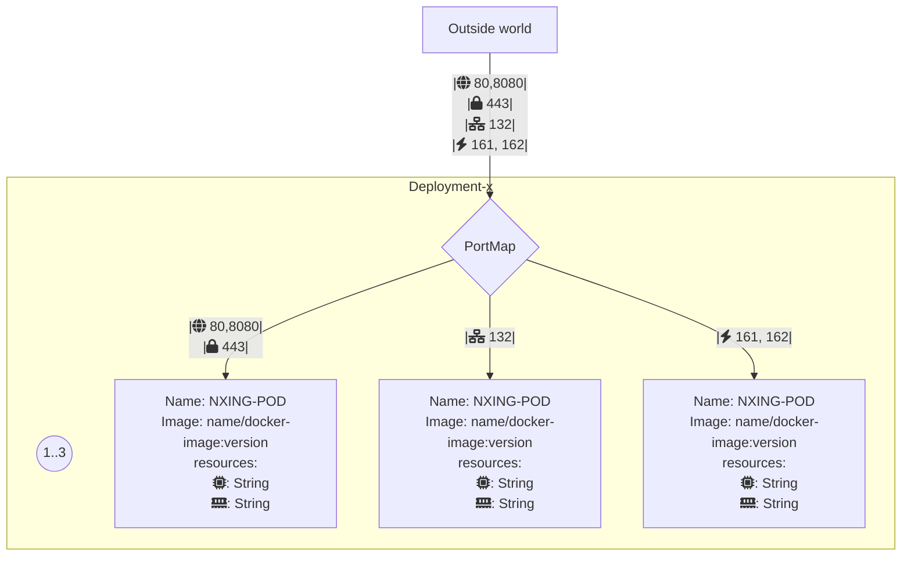

```mermaid
flowchart TD
    B["Outside world"]
    
    B--|fa:fa-globe 80,8080|
        |fa:fa-lock 443|
        |fa:fa-network-wired 132|
        |fa:fa-bolt 161, 162|-->G
    subgraph Deployment-x
        direction RL
        G{PortMap}
        scalar((1..3))
        G--|fa:fa-globe 80,8080|
        |fa:fa-lock 443|-->Container-1["`Name: NXING-POD
                        Image: name/docker-image:version
                        resources:
                            &Tab;fa:fa-microchip: String
                            &Tab;fa:fa-memory: String`"]
        G--|fa:fa-network-wired 132|-->Container-2["`Name: NXING-POD
                        Image: name/docker-image:version
                        resources:
                            &Tab;fa:fa-microchip: String
                            &Tab;fa:fa-memory: String`"]
        G--|fa:fa-bolt 161, 162|-->Container-3["`Name: NXING-POD
                        Image: name/docker-image:version
                        resources:
                            &Tab;fa:fa-microchip: String
                            &Tab;fa:fa-memory: String`"]
    end
```
