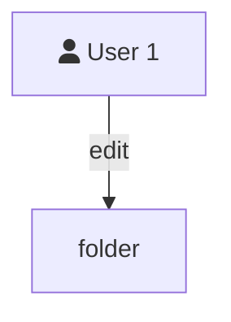
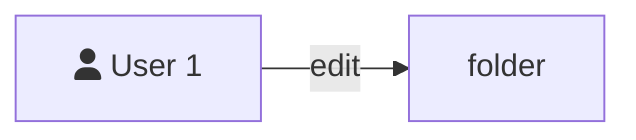

```mermaid
flowchart TD
    subgraph Deployment-x
        direction RL
        G-->Container-1("`Name: NXING-POD
                        Image: name/docker-image:version`")
        G-->Container-2("`Name: NXING-POD
                        Image: name/docker-image:version`")
        G-->Container-3("`Name: NXING-POD
                        Image: name/docker-image:version`")

```


