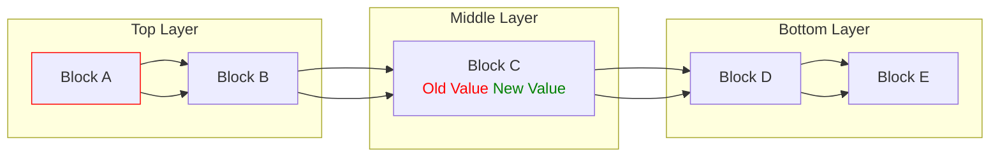

```mermaid
graph LR
    A[Block A] --> B[Block B]
    B --> C[Block C
    <span style='color: red;'>Old Value</span> <span style='color: green;'>New Value</span>]
    C --> D[Block D]
    D --> E[Block E]
    subgraph Top Layer
        A --> B
    end
    subgraph Middle Layer
        B --> C
    end
    subgraph Bottom Layer
        C --> D
        D --> E
    end
    A:::DELETED
classDef DELETED stroke:#f00
classDef NEW stroke:#0f0
classDef UPDATED stroke:#00f
```
