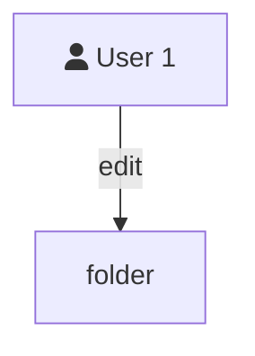

```mermaid
classDef fa_globe fill:#61affe,stroke:#ffffff,stroke-width:2px;
classDef fa_lock fill:#e34f26,stroke:#ffffff,stroke-width:2px;
classDef fa_network_wired fill:#36ae75,stroke:#ffffff,stroke-width:2px;
classDef fa_bolt fill:#ffcc29,stroke:#ffffff,stroke-width:2px;

flowchart TD
    subgraph Deployment-x
        direction RL
        G{PortMap}
        scalar((1..3))
        G-->Container-1("`Name: NXING-POD
                        Image: name/docker-image:version`"):::fa_globe
        G-->Container-2("`Name: NXING-POD
                        Image: name/docker-image:version`"):::fa_lock
        G-->Container-3("`Name: NXING-POD
                        Image: name/docker-image:version`"):::fa_network_wired
    end

```


