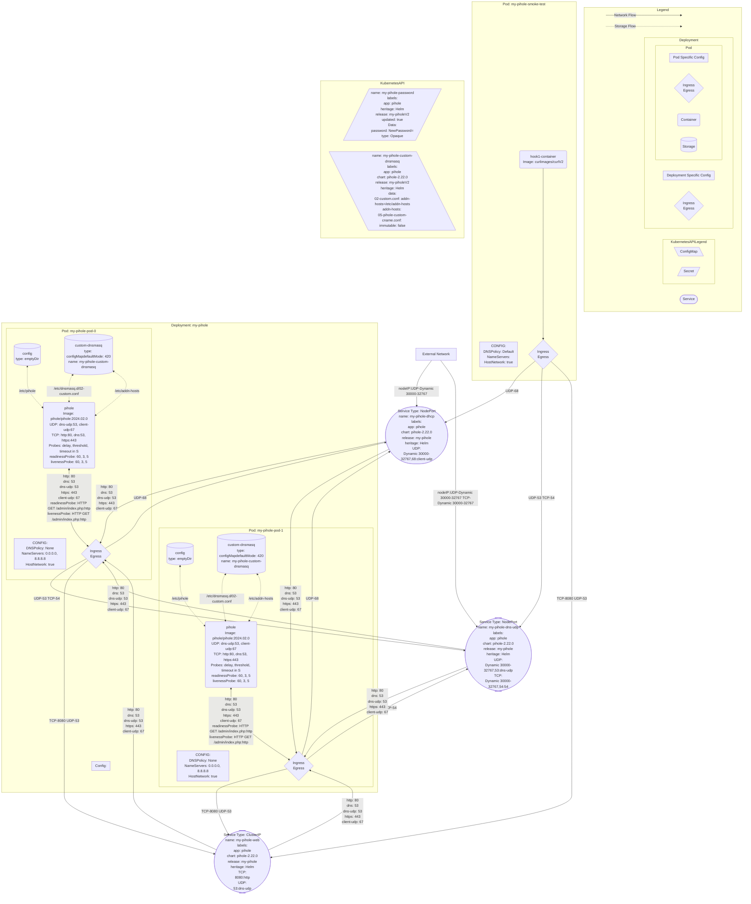

```mermaid
flowchart
subgraph Legend
    direction LR

    start1[ ] -->|Network Flow| stop1[ ]
    style start1 height:0px;
    style stop1 height:0px;
    start2[ ] -.->|Storage Flow| stop2[ ]
    style start2 height:0px;
    style stop2 height:0px; 
    subgraph KubernetesAPILegend
        direction LR
        ParallelogramAlt[\ ConfigMap \]
        Parallelogram[/ Secret /]
    end
    subgraph Deployment
        direction LR
        subgraph DeploymentConfig[Deployment Specific Config]
        end
        Proxy2{Ingress
         Egress}
        subgraph Pod
        direction LR
        subgraph PodConfig[Pod Specific Config]
        end
        Proxy{Ingress
         Egress}
        Container(Container)
        Storage[( Storage )]
        end
    end    
    Stadium([ Service ])
      
    end
external["External Network"]
external --nodeIP:UDP-Dynamic 30000-32767 --> my-pihole-dhcp
external --nodeIP:UDP-Dynamic 30000-32767 TCP-Dynamic 30000-32767 --> my-pihole-dns-udp
my-pihole-pod-0-proxy --UDP-68 --> my-pihole-dhcp
my-pihole-pod-1-proxy --UDP-68 --> my-pihole-dhcp
my-pihole-smoke-test-proxy --UDP-68 --> my-pihole-dhcp
my-pihole-pod-0-proxy --UDP-53 TCP-54 --> my-pihole-dns-udp
my-pihole-pod-1-proxy --UDP-53 TCP-54 --> my-pihole-dns-udp
my-pihole-smoke-test-proxy --UDP-53 TCP-54 --> my-pihole-dns-udp
my-pihole-pod-0-proxy --TCP-8080 UDP-53 --> my-pihole-web
my-pihole-pod-1-proxy --TCP-8080 UDP-53 --> my-pihole-web
my-pihole-smoke-test-proxy --TCP-8080 UDP-53 --> my-pihole-web
subgraph my-pihole-smoke-test [Pod: my-pihole-smoke-test
]
direction BT
subgraph config-my-pihole-smoke-test [CONFIG:
DNSPolicy: Default
NameServers: 
HostNetwork: true
]
end
my-pihole-smoke-test-hook1-container(
hook1-container
Image: curlimages/curlV2
)
my-pihole-smoke-test-proxy{"Ingress
Egress
"}
my-pihole-smoke-test-hook1-container --> my-pihole-smoke-test-proxy
end
subgraph my-pihole [Deployment: my-pihole]
subgraph my-pihole-config [Config:
]
end
subgraph my-pihole-pod-0 [Pod: my-pihole-pod-0
]
direction BT
subgraph config-my-pihole-pod-0 [CONFIG:
DNSPolicy: None
NameServers: 0.0.0.0, 8.8.8.8
HostNetwork: true
]
end
my-pihole-pod-0-pihole(
pihole
Image: pihole/pihole:2024.02.0
UDP: dns-udp:53, client-udp:67
TCP: http:80, dns:53, https:443
Probes: delay, threshold, timeout in S
readinessProbe: 60, 3, 5
livenessProbe: 60, 3, 5
)
my-pihole-pod-0-proxy{"Ingress
Egress
"}
my-pihole-pod-0-pihole <--http: 80
dns: 53
dns-udp: 53
https: 443
client-udp: 67
readinessProbe: HTTP GET /admin/index.php:http
livenessProbe: HTTP GET /admin/index.php:http
-->my-pihole-pod-0-proxy
my-pihole-pod-0-config[("config
type: emptyDir")]
my-pihole-pod-0-custom-dnsmasq[("custom-dnsmasq
type: configMapdefaultMode: 420
name: my-pihole-custom-dnsmasq")]
my-pihole-pod-0-config <-. "/etc/pihole" .-> my-pihole-pod-0-pihole

my-pihole-pod-0-custom-dnsmasq <-. "/etc/dnsmasq.d/02-custom.conf" .-> my-pihole-pod-0-pihole

my-pihole-pod-0-custom-dnsmasq <-. "/etc/addn-hosts" .-> my-pihole-pod-0-pihole
end
subgraph my-pihole-pod-1 [Pod: my-pihole-pod-1
]
direction BT
subgraph config-my-pihole-pod-1 [CONFIG:
DNSPolicy: None
NameServers: 0.0.0.0, 8.8.8.8
HostNetwork: true
]
end
my-pihole-pod-1-pihole(
pihole
Image: pihole/pihole:2024.02.0
UDP: dns-udp:53, client-udp:67
TCP: http:80, dns:53, https:443
Probes: delay, threshold, timeout in S
readinessProbe: 60, 3, 5
livenessProbe: 60, 3, 5
)
my-pihole-pod-1-proxy{"Ingress
Egress
"}
my-pihole-pod-1-pihole <--http: 80
dns: 53
dns-udp: 53
https: 443
client-udp: 67
readinessProbe: HTTP GET /admin/index.php:http
livenessProbe: HTTP GET /admin/index.php:http
-->my-pihole-pod-1-proxy
my-pihole-pod-1-config[("config
type: emptyDir")]
my-pihole-pod-1-custom-dnsmasq[("custom-dnsmasq
type: configMapdefaultMode: 420
name: my-pihole-custom-dnsmasq")]
my-pihole-pod-1-config <-. "/etc/pihole" .-> my-pihole-pod-1-pihole

my-pihole-pod-1-custom-dnsmasq <-. "/etc/dnsmasq.d/02-custom.conf" .-> my-pihole-pod-1-pihole

my-pihole-pod-1-custom-dnsmasq <-. "/etc/addn-hosts" .-> my-pihole-pod-1-pihole
end
end
my-pihole-dhcp([
Service Type: NodePort
name: my-pihole-dhcp
labels:
app: pihole
chart: pihole-2.22.0
release: my-pihole
heritage: Helm
UDP:
Dynamic 30000-32767,68:client-udp
])
my-pihole-dhcp --http: 80
dns: 53
dns-udp: 53
https: 443
client-udp: 67--> my-pihole-pod-0-proxy
my-pihole-dhcp --http: 80
dns: 53
dns-udp: 53
https: 443
client-udp: 67--> my-pihole-pod-1-proxy
my-pihole-dns-udp([
Service Type: NodePort
name: my-pihole-dns-udp
labels:
app: pihole
chart: pihole-2.22.0
release: my-pihole
heritage: Helm
UDP:
Dynamic 30000-32767,53:dns-udp
TCP:
Dynamic 30000-32767,54:54
])
my-pihole-dns-udp --http: 80
dns: 53
dns-udp: 53
https: 443
client-udp: 67--> my-pihole-pod-0-proxy
my-pihole-dns-udp --http: 80
dns: 53
dns-udp: 53
https: 443
client-udp: 67--> my-pihole-pod-1-proxy
my-pihole-web([
Service Type: ClusterIP
name: my-pihole-web
labels:
app: pihole
chart: pihole-2.22.0
release: my-pihole
heritage: Helm
TCP:
8080:http
UDP:
53:dns-udp
])
my-pihole-web --http: 80
dns: 53
dns-udp: 53
https: 443
client-udp: 67--> my-pihole-pod-0-proxy
my-pihole-web --http: 80
dns: 53
dns-udp: 53
https: 443
client-udp: 67--> my-pihole-pod-1-proxy
subgraph KubernetesAPI [KubernetesAPI
]
my-pihole-password[/
name: my-pihole-password
labels:
app: pihole
heritage: Helm
release: my-piholeV2
updated: true
Data:
password: NewPassword=
type: Opaque
/]
my-pihole-custom-dnsmasq[\
name: my-pihole-custom-dnsmasq
labels:
app: pihole
chart: pihole-2.22.0
release: my-piholeV2
heritage: Helm
data:
02-custom.conf: addn-hosts=/etc/addn-hosts
addn-hosts: 
05-pihole-custom-cname.conf: 
immutable: false
\]
end
```