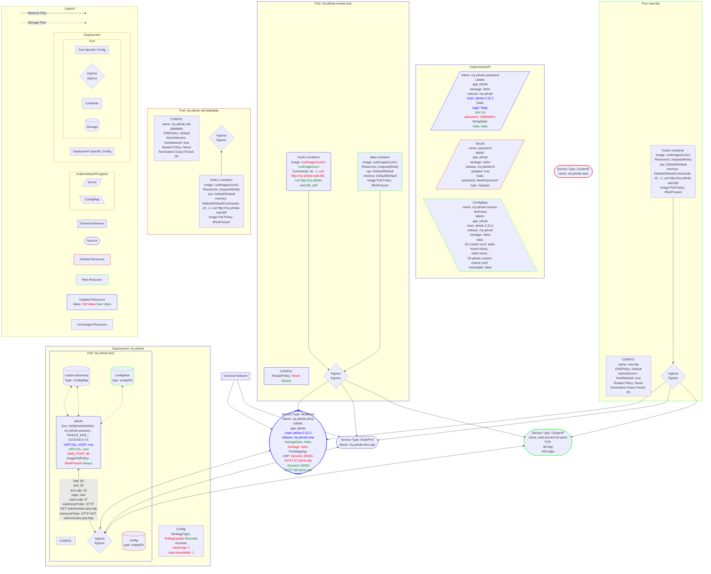

```mermaid
flowchart
external[["External Network"]]
external --> my-pihole-dhcp-service
external --> my-pihole-dns-udp-service
subgraph KubernetesAPI [KubernetesAPI]
my-pihole-password[/
Name: my-pihole-password
Labels:
app: pihole
heritage: Helm
release: my-pihole
<span style='color: blue;'>chart: pihole-2.22.3
</span>Data:
<span style='color: blue;'>login: Wajo
</span><span style='color: green;'>test: lol
</span><span style='color: red;'>password: YWRtaW4=
</span>StringData:
<span style='color: green;'>hello: hello
</span>/]:::UPDATED
password[/
Secret
name: password
labels:
app: pihole
heritage: Helm
release: my-piholeV2
updated: true
Data:
password: NewPassword=
type: Opaque
/]:::DELETED
my-pihole-custom-dnsmasq[\
ConfigMap
name: my-pihole-custom-dnsmasq
labels:
app: pihole
chart: pihole-2.22.0
release: my-pihole
heritage: Helm
data:
02-custom.conf: addn-hosts=/etc/a...
addn-hosts: 
05-pihole-custom-cname.conf: 
immutable: false
\]:::NEW
end
KubernetesAPI:::UPDATED
subgraph my-pihole-smoke-test [Pod: my-pihole-smoke-test
]
direction BT
subgraph config-my-pihole-smoke-test [CONFIG:
RestartPolicy: <span style='color: red;'>Never</span> <span style='color: green;'>Always</span>
]
end
config-my-pihole-smoke-test:::UPDATED
my-pihole-smoke-test-hook1-container(
hook1-container
Image: <span style='color: red;'>curlimages/curlv2</span> <span style='color: green;'>curlimages/curl</span>
Commands: sh, <span style='color: red;'>-c</span>, <span style='color: red;'>curl http://my-pihole-web:80/</span>, <span style='color: green;'>curl http://my-pihole-web:90/</span>, <span style='color: green;'>p00</span>
):::UPDATED
my-pihole-smoke-test-data-container(
data-container
Image: curlimages/curlv1
Resources: &#40request/limits&#41
cpu: Default/Default
memory: Default/Default
Image Pull Policy: IfNotPresent
):::NEW
my-pihole-smoke-test-proxy{"Ingress
Egress
"}
my-pihole-smoke-test-hook1-container --> my-pihole-smoke-test-proxy
my-pihole-smoke-test-data-container --> my-pihole-smoke-test-proxy
end
my-pihole-smoke-test:::UPDATED
subgraph new-bla [Pod: new-bla
]
direction BT
subgraph config-new-bla [CONFIG:
name: new-bla
DNSPolicy: Default
NameServers: 
HostNetwork: true
Restart Policy: Never
Termination Grace Period: 0S
]
end
new-bla-hook1-container(
hook1-container
Image: curlimages/curlv2
Resources: &#40request/limits&#41
cpu: Default/Default
memory: Default/DefaultCommands: sh, -c, curl http://my-pihole-web:80/
Image Pull Policy: IfNotPresent
)
new-bla-proxy{"Ingress
Egress
"}
new-bla-hook1-container --> new-bla-proxy
end
new-bla:::NEW

subgraph my-pihole-old-blablabla [Pod: my-pihole-old-blablabla
]
direction BT
subgraph config-my-pihole-old-blablabla [CONFIG:
name: my-pihole-old-blablabla
DNSPolicy: Default
NameServers: 
HostNetwork: true
Restart Policy: Never
Termination Grace Period: 0S
]
end
my-pihole-old-blablabla-hook1-container(
hook1-container
Image: curlimages/curlv2
Resources: &#40request/limits&#41
cpu: Default/Default
memory: Default/DefaultCommands: sh, -c, curl http://my-pihole-web:80/
Image Pull Policy: IfNotPresent
)
my-pihole-old-blablabla-proxy{"Ingress
Egress
"}
my-pihole-old-blablabla-hook1-container --> my-pihole-old-blablabla-proxy
end
my-pihole-old-blablabla:::DELETED

subgraph my-pihole [Deployment: my-pihole]
subgraph my-pihole-config [Config:
StrategyType: <span style='color: red;'>RollingUpdate</span> <span style='color: green;'>Recreate</span>
recreate:
<span style='color: red;'>maxSurge: 1
maxUnavailable: 1
</span>]
end
subgraph my-pihole-pod-0 [Pod: my-pihole-pod

]
direction BT
subgraph config-my-pihole-pod-0 [CONFIG:
]
end
my-pihole-pod-0-pihole(
pihole
Env: WEBPASSWORD: my-pihole-passwor...
PIHOLE_DNS_: 8.8.8.8;8.8.4.4
<span style='color: blue;'>VIRTUAL_HOST: hey
</span><span style='color: green;'>VIRTUAL: new
</span><span style='color: red;'>WEB_PORT: 80
</span>ImagePullPolicy: <span style='color: red;'>IfNotPresent</span> <span style='color: green;'>Always</span>
):::UPDATED
my-pihole-pod-0-proxy{"Ingress
Egress
"}
my-pihole-pod-0-pihole <--http: 80
dns: 53
dns-udp: 53
https: 443
client-udp: 67
readinessProbe: HTTP GET /admin/index.php:http
livenessProbe: HTTP GET /admin/index.php:http
-->my-pihole-pod-0-proxy
my-pihole-pod-0-custom-dnsmasq[("custom-dnsmasq
Type: ConfigMap
")]
my-pihole-pod-0-configNew[("configNew
type: emptyDir
")]
my-pihole-pod-0-configNew:::NEW

my-pihole-pod-0-config[("config
type: emptyDir
")]
my-pihole-pod-0-config:::DELETED

my-pihole-pod-0-custom-dnsmasq <-.-> my-pihole-pod-0-pihole

my-pihole-pod-0-custom-dnsmasq <-.-> my-pihole-pod-0-pihole

my-pihole-pod-0-configNew <-.-> my-pihole-pod-0-pihole
end
my-pihole-pod-0:::UPDATED
end
my-pihole:::UPDATED
my-pihole-dhcp-service([
Service Type: NodePort
Name: my-pihole-dhcp
Labels:
app: pihole
<span style='color: blue;'>chart: pihole-2.22.3
release: my-pihole-new
</span><span style='color: green;'>heritageNew: Helm
</span><span style='color: red;'>heritage: Helm
</span>PortMapping:
UDP: <span style='color: red;'>Dynamic 30000-32767,67:client-udp
</span>, <span style='color: green;'>Dynamic 30000-32767,88:client-udp
</span>
]):::UPDATED
my-pihole-dhcp-service <-->my-pihole-pod-0-proxy
my-pihole-dns-udp-service([
Service Type: NodePort
Name: my-pihole-dns-udp
])
my-pihole-dns-udp-service <-->my-pihole-pod-0-proxy
web-service-for-piere-service([
Service Type: ClusterIP
name: web-service-for-piere
TCP:
80:http
443:https
])
web-service-for-piere-service <-->my-pihole-pod-0-proxy
web-service-for-piere-service:::NEW

my-pihole-web-service([
Service Type: ClusterIP
name: my-pihole-web
])
my-pihole-web-service:::DELETED

my-pihole-smoke-test-proxy --> my-pihole-dhcp-service
new-bla-proxy --> my-pihole-dhcp-service
my-pihole-smoke-test-proxy --> my-pihole-dns-udp-service
new-bla-proxy --> my-pihole-dns-udp-service
my-pihole-smoke-test-proxy --> web-service-for-piere-service
new-bla-proxy --> web-service-for-piere-service
subgraph Legend
    direction LR

    start1[ ] -->|Network Flow| stop1[ ]
    style start1 height:0px;
    style stop1 height:0px;
    start2[ ] -.->|Storage Flow| stop2[ ]
    style start2 height:0px;
    style stop2 height:0px; 
    externalLegend[["External Network"]]
    subgraph KubernetesAPILegend
        direction LR
        Parallelogram[/ Secret /]
        ParallelogramAlt[\ ConfigMap \]
    end
    subgraph Deployment
        direction LR
        subgraph rootConfig[Deployment Specific Config]
        end
        subgraph Pod
        direction LR
        subgraph PodConfig[Pod Specific Config]
        end
        Proxy{Ingress
         Egress}
        Container(Container)
        Storage[( Storage )]
        end
    end
    Stadium([ Service ])
    DELETED[ Deleted Resource ]:::DELETED
    NEW[ New Resource ]:::NEW
    Updated[ Updated Resource 
    Value: <span style='color: red;'>Old Value</span> <span style='color: green;'>New Value</span>]:::UPDATED
    EQUAL[ Unchanged Resource ]
    end
classDef DELETED stroke:#f00
classDef NEW stroke:#0f0
classDef UPDATED stroke:#00f
```
