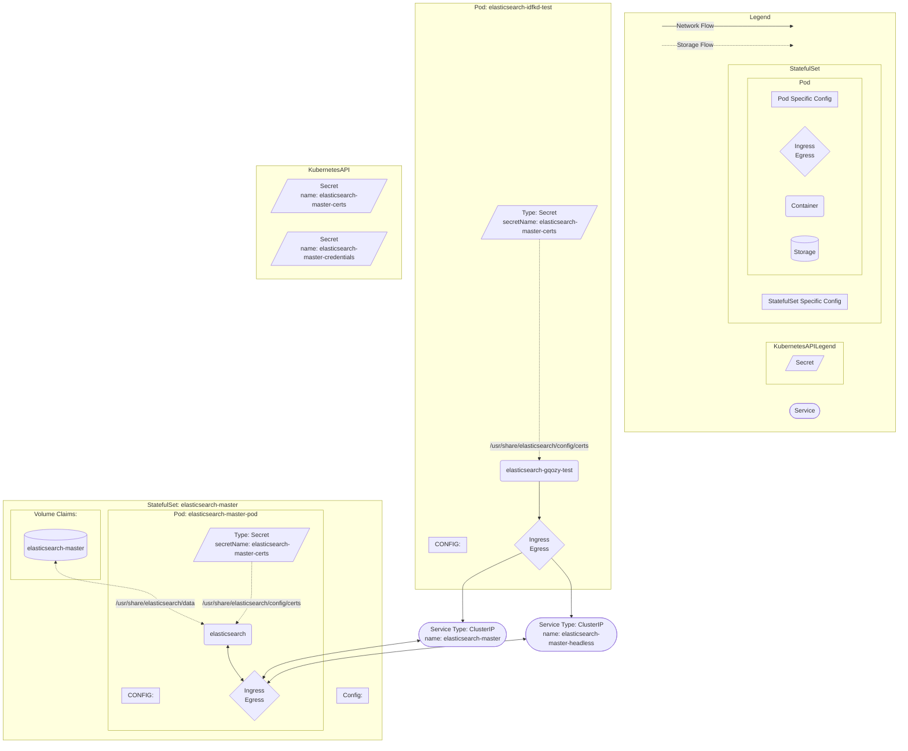

```mermaid
flowchart
subgraph Legend
    direction LR

    start1[ ] -->|Network Flow| stop1[ ]
    style start1 height:0px;
    style stop1 height:0px;
    start2[ ] -.->|Storage Flow| stop2[ ]
    style start2 height:0px;
    style stop2 height:0px; 
    subgraph KubernetesAPILegend
        direction LR
        Parallelogram[/ Secret /]
    end
    subgraph StatefulSet
        direction LR
        subgraph rootConfig[StatefulSet Specific Config]
        end
        subgraph Pod
        direction LR
        subgraph PodConfig[Pod Specific Config]
        end
        Proxy{Ingress
         Egress}
        Container(Container)
        Storage[( Storage )]
        end
    end
    Stadium([ Service ])
    end
elasticsearch-idfkd-test-proxy --> elasticsearch-master-service
elasticsearch-idfkd-test-proxy --> elasticsearch-master-headless-service
subgraph elasticsearch-idfkd-test [Pod: elasticsearch-idfkd-test
]
direction BT
subgraph config-elasticsearch-idfkd-test [CONFIG:
]
end
elasticsearch-idfkd-test-elasticsearch-gqozy-test(
elasticsearch-gqozy-test
)
elasticsearch-idfkd-test-proxy{"Ingress
Egress
"}
elasticsearch-idfkd-test-elasticsearch-gqozy-test --> elasticsearch-idfkd-test-proxy
elasticsearch-idfkd-test-elasticsearch-certs[/
Type: Secret
 secretName: elasticsearch-master-certs/]
elasticsearch-idfkd-test-elasticsearch-certs -. "/usr/share/elasticsearch/config/certs" .-> elasticsearch-idfkd-test-elasticsearch-gqozy-test
end
subgraph elasticsearch-master [StatefulSet: elasticsearch-master]
subgraph elasticsearch-master-pvc [Volume Claims:]
elasticsearch-master-elasticsearch-master-pvc[(
elasticsearch-master
)]
end
subgraph elasticsearch-master-config [Config:
]
end
subgraph elasticsearch-master-pod-0 [Pod: elasticsearch-master-pod]
direction BT
subgraph config-elasticsearch-master-pod-0 [CONFIG:
]
end
elasticsearch-master-pod-0-elasticsearch(
elasticsearch
)
elasticsearch-master-pod-0-proxy{"Ingress
Egress
"}
elasticsearch-master-pod-0-elasticsearch <-->elasticsearch-master-pod-0-proxy
elasticsearch-master-pod-0-elasticsearch-certs[/
Type: Secret
 secretName: elasticsearch-master-certs/]
elasticsearch-master-elasticsearch-master-pvc <-. "/usr/share/elasticsearch/data" .-> elasticsearch-master-pod-0-elasticsearch

elasticsearch-master-pod-0-elasticsearch-certs -. "/usr/share/elasticsearch/config/certs" .-> elasticsearch-master-pod-0-elasticsearch
end
end
elasticsearch-master-service([
Service Type: ClusterIP
name: elasticsearch-master
])
elasticsearch-master-service <-->elasticsearch-master-pod-0-proxy
elasticsearch-master-headless-service([
Service Type: ClusterIP
name: elasticsearch-master-headless
])
elasticsearch-master-headless-service <-->elasticsearch-master-pod-0-proxy
subgraph KubernetesAPI [KubernetesAPI
]
elasticsearch-master-certs[/
Secret
name: elasticsearch-master-certs
/]
elasticsearch-master-credentials[/
Secret
name: elasticsearch-master-credentials
/]
end

```