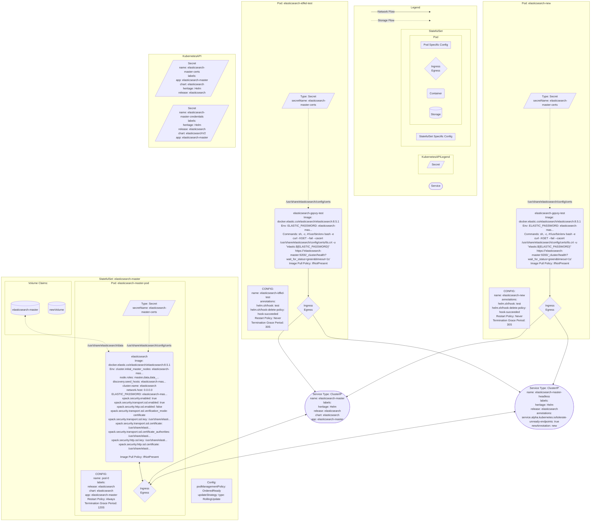

```mermaid
flowchart
subgraph Legend
    direction LR

    start1[ ] -->|Network Flow| stop1[ ]
    style start1 height:0px;
    style stop1 height:0px;
    start2[ ] -.->|Storage Flow| stop2[ ]
    style start2 height:0px;
    style stop2 height:0px; 
    subgraph KubernetesAPILegend
        direction LR
        Parallelogram[/ Secret /]
    end
    subgraph StatefulSet
        direction LR
        subgraph rootConfig[StatefulSet Specific Config]
        end
        subgraph Pod
        direction LR
        subgraph PodConfig[Pod Specific Config]
        end
        Proxy{Ingress
         Egress}
        Container(Container)
        Storage[( Storage )]
        end
    end
    Stadium([ Service ])
    end
elasticsearch-idfkd-test-proxy --> elasticsearch-master-service
elasticsearch-new-proxy --> elasticsearch-master-service
elasticsearch-idfkd-test-proxy --> elasticsearch-master-headless-service
elasticsearch-new-proxy --> elasticsearch-master-headless-service
subgraph elasticsearch-idfkd-test [Pod: elasticsearch-idfkd-test
]
direction BT
subgraph config-elasticsearch-idfkd-test [CONFIG:
name: elasticsearch-idfkd-test
annotations:
helm.sh/hook: test
helm.sh/hook-delete-policy: hook-succeeded
Restart Policy: Never
Termination Grace Period: 30S
]
end
elasticsearch-idfkd-test-elasticsearch-gqozy-test(
elasticsearch-gqozy-test
Image: docker.elastic.co/elasticsearch/elasticsearch:8.5.1
Env: ELASTIC_PASSWORD: elasticsearch-mas...
Commands: sh, -c, #!/usr/bin/env bash -e
curl -XGET --fail --cacert /usr/share/elasticsearch/config/certs/tls.crt -u &quotelastic:$&#123ELASTIC_PASSWORD&#125&quot https://'elasticsearch-master:9200/_cluster/health?wait_for_status=green&timeout=1s'
Image Pull Policy: IfNotPresent
)
elasticsearch-idfkd-test-proxy{"Ingress
Egress
"}
elasticsearch-idfkd-test-elasticsearch-gqozy-test --> elasticsearch-idfkd-test-proxy
elasticsearch-idfkd-test-elasticsearch-certs[/
Type: Secret
 secretName: elasticsearch-master-certs/]
elasticsearch-idfkd-test-elasticsearch-certs -. "/usr/share/elasticsearch/config/certs" .-> elasticsearch-idfkd-test-elasticsearch-gqozy-test
end
subgraph elasticsearch-new [Pod: elasticsearch-new
]
direction BT
subgraph config-elasticsearch-new [CONFIG:
name: elasticsearch-new
annotations:
helm.sh/hook: test
helm.sh/hook-delete-policy: hook-succeeded
Restart Policy: Never
Termination Grace Period: 30S
]
end
elasticsearch-new-elasticsearch-gqozy-test(
elasticsearch-gqozy-test
Image: docker.elastic.co/elasticsearch/elasticsearch:8.5.1
Env: ELASTIC_PASSWORD: elasticsearch-mas...
Commands: sh, -c, #!/usr/bin/env bash -e
curl -XGET --fail --cacert /usr/share/elasticsearch/config/certs/tls.crt -u &quotelastic:$&#123ELASTIC_PASSWORD&#125&quot https://'elasticsearch-master:9200/_cluster/health?wait_for_status=green&timeout=1s'
Image Pull Policy: IfNotPresent
)
elasticsearch-new-proxy{"Ingress
Egress
"}
elasticsearch-new-elasticsearch-gqozy-test --> elasticsearch-new-proxy
elasticsearch-new-elasticsearch-certs[/
Type: Secret
 secretName: elasticsearch-master-certs/]
elasticsearch-new-elasticsearch-certs -. "/usr/share/elasticsearch/config/certs" .-> elasticsearch-new-elasticsearch-gqozy-test
end
subgraph elasticsearch-master [StatefulSet: elasticsearch-master]
subgraph elasticsearch-master-pvc [Volume Claims:]
elasticsearch-master-elasticsearch-master-pvc[(
elasticsearch-master
)]

elasticsearch-master-newVolume-pvc[(
newVolume
)]
end
subgraph elasticsearch-master-config [Config:
podManagementPolicy: OrderedReady
updateStrategy: type: RollingUpdate

]
end
subgraph elasticsearch-master-pod-0 [Pod: elasticsearch-master-pod]
direction BT
subgraph config-elasticsearch-master-pod-0 [CONFIG:
name: pod-0
labels:
release: elasticsearch
chart: elasticsearch
app: elasticsearch-master
Restart Policy: Always
Termination Grace Period: 120S
]
end
elasticsearch-master-pod-0-elasticsearch(
elasticsearch
Image: docker.elastic.co/elasticsearch/elasticsearch:8.5.1
Env: cluster.initial_master_nodes: elasticsearch-mas...
node.roles: master,data,data_...
discovery.seed_hosts: elasticsearch-mas...
cluster.name: elasticsearch
network.host: 0.0.0.0
ELASTIC_PASSWORD: elasticsearch-mas...
xpack.security.enabled: true
xpack.security.transport.ssl.enabled: true
xpack.security.http.ssl.enabled: false
xpack.security.transport.ssl.verification_mode: certificate
xpack.security.transport.ssl.key: /usr/share/elasti...
xpack.security.transport.ssl.certificate: /usr/share/elasti...
xpack.security.transport.ssl.certificate_authorities: /usr/share/elasti...
xpack.security.http.ssl.key: /usr/share/elasti...
xpack.security.http.ssl.certificate: /usr/share/elasti...

Image Pull Policy: IfNotPresent
)
elasticsearch-master-pod-0-proxy{"Ingress
Egress
"}
elasticsearch-master-pod-0-elasticsearch <-->elasticsearch-master-pod-0-proxy
elasticsearch-master-pod-0-elasticsearch-certs[/
Type: Secret
 secretName: elasticsearch-master-certs/]
elasticsearch-master-elasticsearch-master-pvc <-. "/usr/share/elasticsearch/data" .-> elasticsearch-master-pod-0-elasticsearch

elasticsearch-master-pod-0-elasticsearch-certs -. "/usr/share/elasticsearch/config/certs" .-> elasticsearch-master-pod-0-elasticsearch
end
end
elasticsearch-master-service([
Service Type: ClusterIP
name: elasticsearch-master
labels:
heritage: Helm
release: elasticsearch
chart: elasticsearch
app: elasticsearch-master
])
elasticsearch-master-service <-->elasticsearch-master-pod-0-proxy
elasticsearch-master-headless-service([
Service Type: ClusterIP
name: elasticsearch-master-headless
labels:
heritage: Helm
release: elasticsearch
annotations:
service.alpha.kubernetes.io/tolerate-unready-endpoints: true
newAnnotation: new
])
elasticsearch-master-headless-service <-->elasticsearch-master-pod-0-proxy
subgraph KubernetesAPI [KubernetesAPI
]
elasticsearch-master-certs[/
Secret
name: elasticsearch-master-certs
labels:
app: elasticsearch-master
chart: elasticsearch
heritage: Helm
release: elasticsearch
/]
elasticsearch-master-credentials[/
Secret
name: elasticsearch-master-credentials
labels:
heritage: Helm
release: elasticsearch
chart: elasticsearchV2
app: elasticsearch-master
/]
end

```