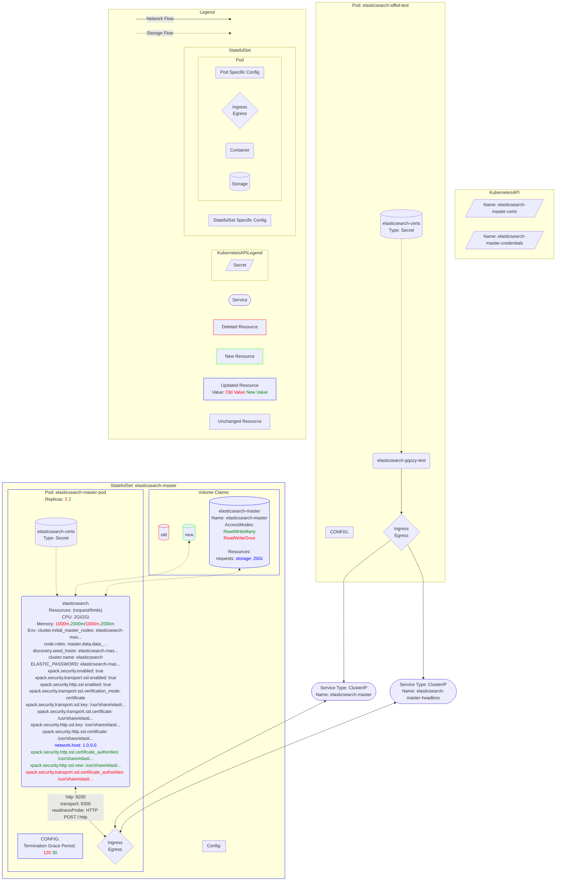

```mermaid
flowchart
subgraph KubernetesAPI [KubernetesAPI]
elasticsearch-master-certs[/
Name: elasticsearch-master-certs
/]
elasticsearch-master-credentials[/
Name: elasticsearch-master-credentials
/]
end
subgraph elasticsearch-idfkd-test [Pod: elasticsearch-idfkd-test
]
direction BT
subgraph config-elasticsearch-idfkd-test [CONFIG:
]
end
elasticsearch-idfkd-test-elasticsearch-gqozy-test(
elasticsearch-gqozy-test
)
elasticsearch-idfkd-test-proxy{"Ingress
Egress
"}
elasticsearch-idfkd-test-elasticsearch-gqozy-test --> elasticsearch-idfkd-test-proxy
elasticsearch-idfkd-test-elasticsearch-certs[("elasticsearch-certs
Type: Secret
")]
elasticsearch-idfkd-test-elasticsearch-certs -.-> elasticsearch-idfkd-test-elasticsearch-gqozy-test
end
subgraph elasticsearch-master [StatefulSet: elasticsearch-master]
subgraph elasticsearch-master-config [Config:
]
end
subgraph elasticsearch-master-pvc [Volume Claims:]
elasticsearch-master-old-pvc[(
old
)]:::DELETED
elasticsearch-master-new-pvc[(
new
)]:::NEW
elasticsearch-master-elasticsearch-master-pvc[(
elasticsearch-master
Name: elasticsearch-master
AccessModes:
<span style='color: green;'>ReadWriteMany</span>
<span style='color: red;'>ReadWriteOnce</span>

Resources: 
requests: <span style='color: blue;'>storage: 20Gi
</span>)]:::UPDATED
end
elasticsearch-master-pvc:::UPDATED
subgraph elasticsearch-master-pod-0 [Pod: elasticsearch-master-pod
Replicas: <span style='color: red;'>3</span> <span style='color: green;'>2</span>

]
direction BT
subgraph config-elasticsearch-master-pod-0 [CONFIG:
Termination Grace Period: <span style='color: red;'>120</span> <span style='color: green;'>30</span>
]
end
config-elasticsearch-master-pod-0:::UPDATED
elasticsearch-master-pod-0-elasticsearch(
elasticsearch
Resources: &#40request/limits&#41
CPU: 2Gi/2Gi
Memory: <span style='color: red;'>1000m</span>,<span style='color: green;'>2000m</span>/<span style='color: red;'>1000m</span>,<span style='color: green;'>2000m</span>
Env: cluster.initial_master_nodes: elasticsearch-mas...
node.roles: master,data,data_...
discovery.seed_hosts: elasticsearch-mas...
cluster.name: elasticsearch
ELASTIC_PASSWORD: elasticsearch-mas...
xpack.security.enabled: true
xpack.security.transport.ssl.enabled: true
xpack.security.http.ssl.enabled: true
xpack.security.transport.ssl.verification_mode: certificate
xpack.security.transport.ssl.key: /usr/share/elasti...
xpack.security.transport.ssl.certificate: /usr/share/elasti...
xpack.security.http.ssl.key: /usr/share/elasti...
xpack.security.http.ssl.certificate: /usr/share/elasti...
<span style='color: blue;'>network.host: 1.0.0.0
</span><span style='color: green;'>xpack.security.http.ssl.certificate_authorities: /usr/share/elasti...
xpack.security.http.ssl.new: /usr/share/elasti...
</span><span style='color: red;'>xpack.security.transport.ssl.certificate_authorities: /usr/share/elasti...
</span>):::UPDATED
elasticsearch-master-pod-0-proxy{"Ingress
Egress
"}
elasticsearch-master-pod-0-elasticsearch <--http: 9200
transport: 9300
readinessProbe: HTTP POST /:http
-->elasticsearch-master-pod-0-proxy
elasticsearch-master-pod-0-elasticsearch-certs[("elasticsearch-certs
Type: Secret
")]
elasticsearch-master-elasticsearch-master-pvc <-.-> elasticsearch-master-pod-0-elasticsearch

elasticsearch-master-pod-0-elasticsearch-certs -.-> elasticsearch-master-pod-0-elasticsearch

elasticsearch-master-new-pvc <-.-> elasticsearch-master-pod-0-elasticsearch
end
elasticsearch-master-pod-0:::UPDATED
end
elasticsearch-master:::UPDATED
elasticsearch-master-service([
Service Type: ClusterIP
Name: elasticsearch-master
])
elasticsearch-master-service <-->elasticsearch-master-pod-0-proxy
elasticsearch-master-headless-service([
Service Type: ClusterIP
Name: elasticsearch-master-headless
])
elasticsearch-master-headless-service <-->elasticsearch-master-pod-0-proxy
elasticsearch-idfkd-test-proxy --> elasticsearch-master-service
elasticsearch-idfkd-test-proxy --> elasticsearch-master-headless-service
subgraph Legend
    direction LR

    start1[ ] -->|Network Flow| stop1[ ]
    style start1 height:0px;
    style stop1 height:0px;
    start2[ ] -.->|Storage Flow| stop2[ ]
    style start2 height:0px;
    style stop2 height:0px; 
    subgraph KubernetesAPILegend
        direction LR
        Parallelogram[/ Secret /]
    end
    subgraph StatefulSet
        direction LR
        subgraph rootConfig[StatefulSet Specific Config]
        end
        subgraph Pod
        direction LR
        subgraph PodConfig[Pod Specific Config]
        end
        Proxy{Ingress
         Egress}
        Container(Container)
        Storage[( Storage )]
        end
    end
    Stadium([ Service ])
    DELETED[ Deleted Resource ]:::DELETED
    NEW[ New Resource ]:::NEW
    Updated[ Updated Resource 
    Value: <span style='color: red;'>Old Value</span> <span style='color: green;'>New Value</span>]:::UPDATED
    EQUAL[ Unchanged Resource ]
    end
classDef DELETED stroke:#f00
classDef NEW stroke:#0f0
classDef UPDATED stroke:#00f
```
