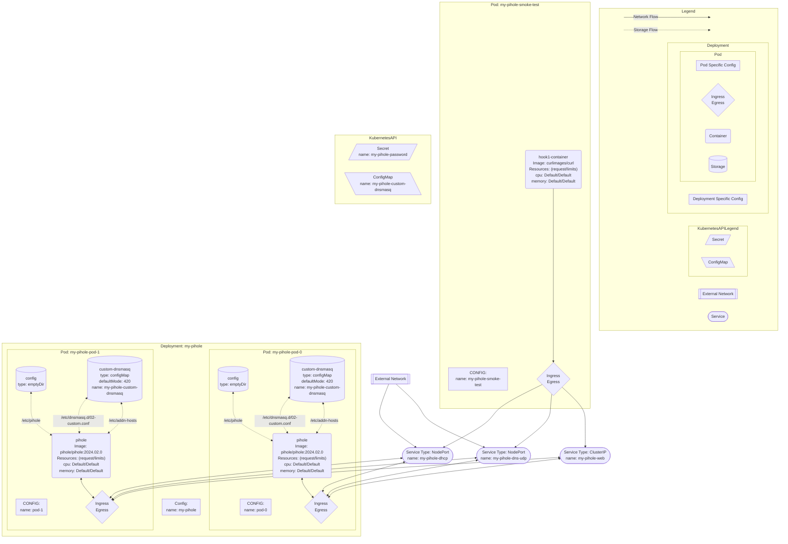

```mermaid
flowchart
subgraph Legend
    direction LR

    start1[ ] -->|Network Flow| stop1[ ]
    style start1 height:0px;
    style stop1 height:0px;
    start2[ ] -.->|Storage Flow| stop2[ ]
    style start2 height:0px;
    style stop2 height:0px; 
    externalLegend[["External Network"]]
    subgraph KubernetesAPILegend
        direction LR
        Parallelogram[/ Secret /]
        ParallelogramAlt[\ ConfigMap \]
    end
    subgraph Deployment
        direction LR
        subgraph rootConfig[Deployment Specific Config]
        end
        subgraph Pod
        direction LR
        subgraph PodConfig[Pod Specific Config]
        end
        Proxy{Ingress
         Egress}
        Container(Container)
        Storage[( Storage )]
        end
    end
    Stadium([ Service ])
    end
external[["External Network"]]
external --> my-pihole-dhcp-service
external --> my-pihole-dns-udp-service
my-pihole-smoke-test-proxy --> my-pihole-dhcp-service
my-pihole-smoke-test-proxy --> my-pihole-dns-udp-service
my-pihole-smoke-test-proxy --> my-pihole-web-service
subgraph my-pihole-smoke-test [Pod: my-pihole-smoke-test
]
direction BT
subgraph config-my-pihole-smoke-test [CONFIG:
name: my-pihole-smoke-test
]
end
my-pihole-smoke-test-hook1-container(
hook1-container
Image: curlimages/curl
Resources: &#40request/limits&#41
cpu: Default/Default
memory: Default/Default)
my-pihole-smoke-test-proxy{"Ingress
Egress
"}
my-pihole-smoke-test-hook1-container --> my-pihole-smoke-test-proxy
end
subgraph my-pihole [Deployment: my-pihole]
subgraph my-pihole-config [Config:
name: my-pihole
]
end
subgraph my-pihole-pod-0 [Pod: my-pihole-pod-0
]
direction BT
subgraph config-my-pihole-pod-0 [CONFIG:
name: pod-0
]
end
my-pihole-pod-0-pihole(
pihole
Image: pihole/pihole:2024.02.0
Resources: &#40request/limits&#41
cpu: Default/Default
memory: Default/Default)
my-pihole-pod-0-proxy{"Ingress
Egress
"}
my-pihole-pod-0-pihole <-->my-pihole-pod-0-proxy
my-pihole-pod-0-config[("config
type: emptyDir
")]
my-pihole-pod-0-custom-dnsmasq[("custom-dnsmasq
type: configMap
defaultMode: 420
name: my-pihole-custom-dnsmasq")]
my-pihole-pod-0-config <-. "/etc/pihole" .-> my-pihole-pod-0-pihole

my-pihole-pod-0-custom-dnsmasq <-. "/etc/dnsmasq.d/02-custom.conf" .-> my-pihole-pod-0-pihole

my-pihole-pod-0-custom-dnsmasq <-. "/etc/addn-hosts" .-> my-pihole-pod-0-pihole
end
subgraph my-pihole-pod-1 [Pod: my-pihole-pod-1
]
direction BT
subgraph config-my-pihole-pod-1 [CONFIG:
name: pod-1
]
end
my-pihole-pod-1-pihole(
pihole
Image: pihole/pihole:2024.02.0
Resources: &#40request/limits&#41
cpu: Default/Default
memory: Default/Default)
my-pihole-pod-1-proxy{"Ingress
Egress
"}
my-pihole-pod-1-pihole <-->my-pihole-pod-1-proxy
my-pihole-pod-1-config[("config
type: emptyDir
")]
my-pihole-pod-1-custom-dnsmasq[("custom-dnsmasq
type: configMap
defaultMode: 420
name: my-pihole-custom-dnsmasq")]
my-pihole-pod-1-config <-. "/etc/pihole" .-> my-pihole-pod-1-pihole

my-pihole-pod-1-custom-dnsmasq <-. "/etc/dnsmasq.d/02-custom.conf" .-> my-pihole-pod-1-pihole

my-pihole-pod-1-custom-dnsmasq <-. "/etc/addn-hosts" .-> my-pihole-pod-1-pihole
end
end
my-pihole-dhcp-service([
Service Type: NodePort
name: my-pihole-dhcp
])
my-pihole-dhcp-service <-->my-pihole-pod-0-proxy
my-pihole-dhcp-service <-->my-pihole-pod-1-proxy
my-pihole-dns-udp-service([
Service Type: NodePort
name: my-pihole-dns-udp
])
my-pihole-dns-udp-service <-->my-pihole-pod-0-proxy
my-pihole-dns-udp-service <-->my-pihole-pod-1-proxy
my-pihole-web-service([
Service Type: ClusterIP
name: my-pihole-web
])
my-pihole-web-service <-->my-pihole-pod-0-proxy
my-pihole-web-service <-->my-pihole-pod-1-proxy
subgraph KubernetesAPI [KubernetesAPI
]
my-pihole-password[/
Secret
name: my-pihole-password
/]
my-pihole-custom-dnsmasq[\
ConfigMap
name: my-pihole-custom-dnsmasq
\]
end
```
