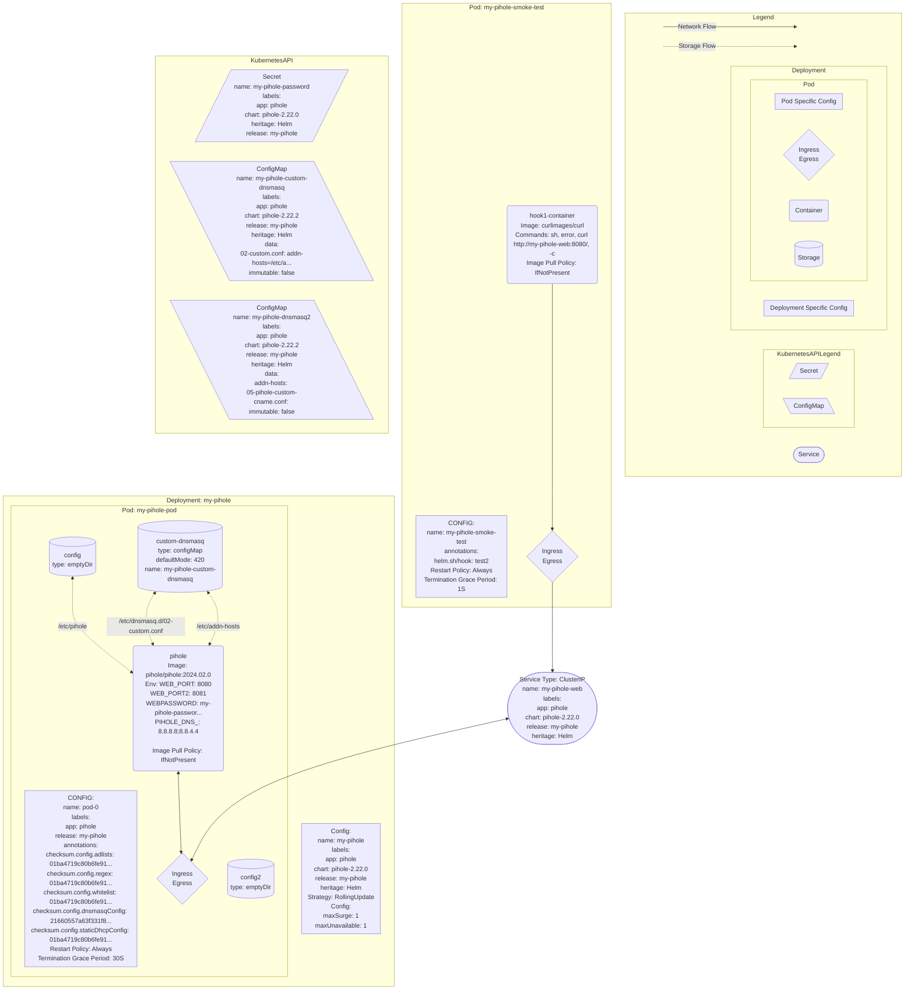

```mermaid
flowchart
subgraph Legend
    direction LR

    start1[ ] -->|Network Flow| stop1[ ]
    style start1 height:0px;
    style stop1 height:0px;
    start2[ ] -.->|Storage Flow| stop2[ ]
    style start2 height:0px;
    style stop2 height:0px; 
    subgraph KubernetesAPILegend
        direction LR
        Parallelogram[/ Secret /]
        ParallelogramAlt[\ ConfigMap \]
    end
    subgraph Deployment
        direction LR
        subgraph rootConfig[Deployment Specific Config]
        end
        subgraph Pod
        direction LR
        subgraph PodConfig[Pod Specific Config]
        end
        Proxy{Ingress
         Egress}
        Container(Container)
        Storage[( Storage )]
        end
    end
    Stadium([ Service ])
    end
my-pihole-smoke-test-proxy --> my-pihole-web-service
subgraph my-pihole-smoke-test [Pod: my-pihole-smoke-test
]
direction BT
subgraph config-my-pihole-smoke-test [CONFIG:
name: my-pihole-smoke-test
annotations:
helm.sh/hook: test2
Restart Policy: Always
Termination Grace Period: 1S
]
end
my-pihole-smoke-test-hook1-container(
hook1-container
Image: curlimages/curl
Commands: sh, error, curl http://my-pihole-web:8080/, -c
Image Pull Policy: IfNotPresent
)
my-pihole-smoke-test-proxy{"Ingress
Egress
"}
my-pihole-smoke-test-hook1-container --> my-pihole-smoke-test-proxy
end
subgraph my-pihole [Deployment: my-pihole]
subgraph my-pihole-config [Config:
name: my-pihole
labels:
app: pihole
chart: pihole-2.22.0
release: my-pihole
heritage: Helm
Strategy: RollingUpdate
Config:
maxSurge: 1
maxUnavailable: 1

]
end
subgraph my-pihole-pod-0 [Pod: my-pihole-pod]
direction BT
subgraph config-my-pihole-pod-0 [CONFIG:
name: pod-0
labels:
app: pihole
release: my-pihole
annotations:
checksum.config.adlists: 01ba4719c80b6fe91...
checksum.config.regex: 01ba4719c80b6fe91...
checksum.config.whitelist: 01ba4719c80b6fe91...
checksum.config.dnsmasqConfig: 21660557a63f331f8...
checksum.config.staticDhcpConfig: 01ba4719c80b6fe91...
Restart Policy: Always
Termination Grace Period: 30S
]
end
my-pihole-pod-0-pihole(
pihole
Image: pihole/pihole:2024.02.0
Env: WEB_PORT: 8080
WEB_PORT2: 8081
WEBPASSWORD: my-pihole-passwor...
PIHOLE_DNS_: 8.8.8.8;8.8.4.4

Image Pull Policy: IfNotPresent
)
my-pihole-pod-0-proxy{"Ingress
Egress
"}
my-pihole-pod-0-pihole <-->my-pihole-pod-0-proxy
my-pihole-pod-0-config[("config
type: emptyDir
")]
my-pihole-pod-0-config2[("config2
type: emptyDir
")]
my-pihole-pod-0-custom-dnsmasq[("custom-dnsmasq
type: configMap
defaultMode: 420
name: my-pihole-custom-dnsmasq")]
my-pihole-pod-0-config <-. "/etc/pihole" .-> my-pihole-pod-0-pihole

my-pihole-pod-0-custom-dnsmasq <-. "/etc/dnsmasq.d/02-custom.conf" .-> my-pihole-pod-0-pihole

my-pihole-pod-0-custom-dnsmasq <-. "/etc/addn-hosts" .-> my-pihole-pod-0-pihole
end
end
my-pihole-web-service([
Service Type: ClusterIP
name: my-pihole-web
labels:
app: pihole
chart: pihole-2.22.0
release: my-pihole
heritage: Helm
])
my-pihole-web-service <-->my-pihole-pod-0-proxy
subgraph KubernetesAPI [KubernetesAPI
]
my-pihole-password[/
Secret
name: my-pihole-password
labels:
app: pihole
chart: pihole-2.22.0
heritage: Helm
release: my-pihole
/]
my-pihole-custom-dnsmasq[\
ConfigMap
name: my-pihole-custom-dnsmasq
labels:
app: pihole
chart: pihole-2.22.2
release: my-pihole
heritage: Helm
data:
02-custom.conf: addn-hosts=/etc/a...
immutable: false
\]
my-pihole-dnsmasq2[\
ConfigMap
name: my-pihole-dnsmasq2
labels:
app: pihole
chart: pihole-2.22.2
release: my-pihole
heritage: Helm
data:
addn-hosts: 
05-pihole-custom-cname.conf: 
immutable: false
\]
end

```