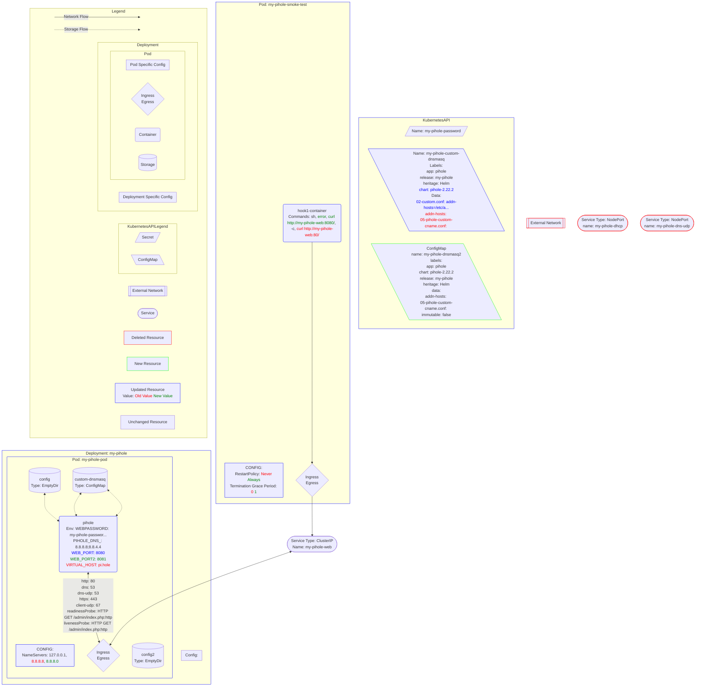

```mermaid
flowchart
external[["External Network"]]:::DELETED
subgraph KubernetesAPI [KubernetesAPI]
my-pihole-password[/
Name: my-pihole-password
/]
my-pihole-custom-dnsmasq[\
Name: my-pihole-custom-dnsmasq
Labels:
app: pihole
release: my-pihole
heritage: Helm
<span style='color: blue;'>chart: pihole-2.22.2
</span>Data:
<span style='color: blue;'>02-custom.conf: addn-hosts=/etc/a...
</span><span style='color: red;'>addn-hosts: 
05-pihole-custom-cname.conf: 
</span>\]:::UPDATED
my-pihole-dnsmasq2[\
ConfigMap
name: my-pihole-dnsmasq2
labels:
app: pihole
chart: pihole-2.22.2
release: my-pihole
heritage: Helm
data:
addn-hosts: 
05-pihole-custom-cname.conf: 
immutable: false
\]:::NEW
end
KubernetesAPI:::UPDATED
subgraph my-pihole-smoke-test [Pod: my-pihole-smoke-test
]
direction BT
subgraph config-my-pihole-smoke-test [CONFIG:
RestartPolicy: <span style='color: red;'>Never</span> <span style='color: green;'>Always</span>
Termination Grace Period: <span style='color: red;'>0</span> <span style='color: green;'>1</span>
]
end
config-my-pihole-smoke-test:::UPDATED
my-pihole-smoke-test-hook1-container(
hook1-container
Commands: sh, <span style='color: green;'>error</span>, <span style='color: green;'>curl http://my-pihole-web:8080/</span>, -c, <span style='color: red;'>curl http://my-pihole-web:80/</span>
):::UPDATED
my-pihole-smoke-test-proxy{"Ingress
Egress
"}
my-pihole-smoke-test-hook1-container --> my-pihole-smoke-test-proxy
end
my-pihole-smoke-test:::UPDATED
subgraph my-pihole [Deployment: my-pihole]
subgraph my-pihole-config [Config:
]
end
subgraph my-pihole-pod-0 [Pod: my-pihole-pod

]
direction BT
subgraph config-my-pihole-pod-0 [CONFIG:
NameServers: 127.0.0.1, <span style='color: red;'>8.8.8.8</span>, <span style='color: green;'>8.8.8.0</span>
]
end
config-my-pihole-pod-0:::UPDATED
my-pihole-pod-0-pihole(
pihole
Env: WEBPASSWORD: my-pihole-passwor...
PIHOLE_DNS_: 8.8.8.8;8.8.4.4
<span style='color: blue;'>WEB_PORT: 8080
</span><span style='color: green;'>WEB_PORT2: 8081
</span><span style='color: red;'>VIRTUAL_HOST: pi.hole
</span>):::UPDATED
my-pihole-pod-0-proxy{"Ingress
Egress
"}
my-pihole-pod-0-pihole <--http: 80
dns: 53
dns-udp: 53
https: 443
client-udp: 67
readinessProbe: HTTP GET /admin/index.php:http
livenessProbe: HTTP GET /admin/index.php:http
-->my-pihole-pod-0-proxy
my-pihole-pod-0-config[("config
Type: EmptyDir
")]
my-pihole-pod-0-config2[("config2
Type: EmptyDir
")]
my-pihole-pod-0-custom-dnsmasq[("custom-dnsmasq
Type: ConfigMap
")]
my-pihole-pod-0-config <-.-> my-pihole-pod-0-pihole

my-pihole-pod-0-custom-dnsmasq <-.-> my-pihole-pod-0-pihole

my-pihole-pod-0-custom-dnsmasq <-.-> my-pihole-pod-0-pihole
end
my-pihole-pod-0:::UPDATED
end
my-pihole:::UPDATED
my-pihole-web-service([
Service Type: ClusterIP
Name: my-pihole-web
])
my-pihole-web-service <-->my-pihole-pod-0-proxy
my-pihole-dhcp-service([
Service Type: NodePort
name: my-pihole-dhcp
])
my-pihole-dhcp-service:::DELETED

my-pihole-dns-udp-service([
Service Type: NodePort
name: my-pihole-dns-udp
])
my-pihole-dns-udp-service:::DELETED

my-pihole-smoke-test-proxy --> my-pihole-web-service
subgraph Legend
    direction LR

    start1[ ] -->|Network Flow| stop1[ ]
    style start1 height:0px;
    style stop1 height:0px;
    start2[ ] -.->|Storage Flow| stop2[ ]
    style start2 height:0px;
    style stop2 height:0px; 
    externalLegend[["External Network"]]
    subgraph KubernetesAPILegend
        direction LR
        Parallelogram[/ Secret /]
        ParallelogramAlt[\ ConfigMap \]
    end
    subgraph Deployment
        direction LR
        subgraph rootConfig[Deployment Specific Config]
        end
        subgraph Pod
        direction LR
        subgraph PodConfig[Pod Specific Config]
        end
        Proxy{Ingress
         Egress}
        Container(Container)
        Storage[( Storage )]
        end
    end
    Stadium([ Service ])
    DELETED[ Deleted Resource ]:::DELETED
    NEW[ New Resource ]:::NEW
    Updated[ Updated Resource 
    Value: <span style='color: red;'>Old Value</span> <span style='color: green;'>New Value</span>]:::UPDATED
    EQUAL[ Unchanged Resource ]
    end
classDef DELETED stroke:#f00
classDef NEW stroke:#0f0
classDef UPDATED stroke:#00f
```