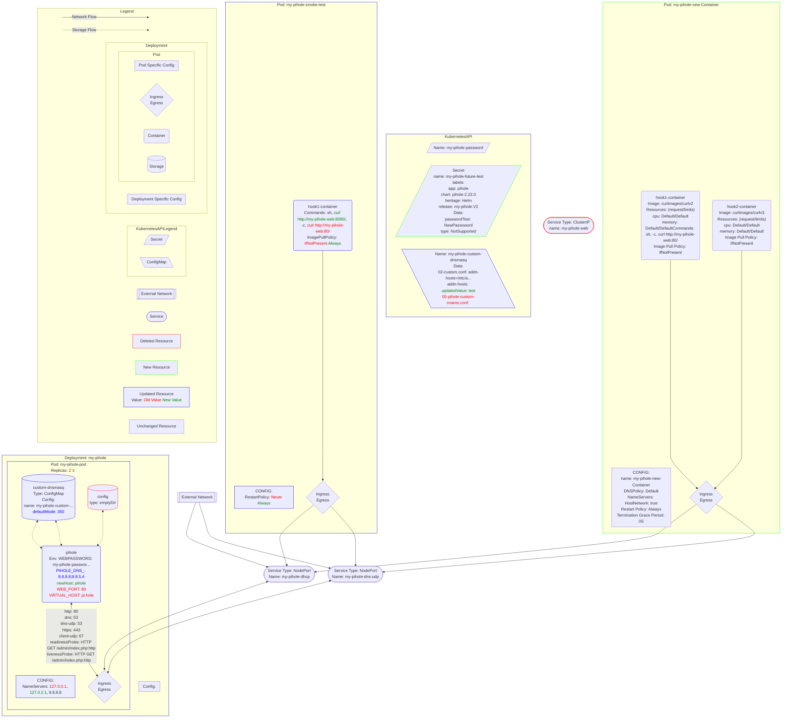

```mermaid
flowchart
external[["External Network"]]
external --> my-pihole-dhcp-service
external --> my-pihole-dns-udp-service
subgraph KubernetesAPI [KubernetesAPI]
my-pihole-password[/
Name: my-pihole-password
/]
my-pihole-future-test[/
Secret
name: my-pihole-future-test
labels:
app: pihole
chart: pihole-2.22.0
heritage: Helm
release: my-pihole.V2
Data:
passwordTest: NewPassoword
type: NotSupported
/]:::NEW
my-pihole-custom-dnsmasq[\
Name: my-pihole-custom-dnsmasq
Data:
02-custom.conf: addn-hosts=/etc/a...
addn-hosts: 
<span style='color: green;'>updatedValue: test
</span><span style='color: red;'>05-pihole-custom-cname.conf: 
</span>\]:::UPDATED
end
KubernetesAPI:::UPDATED
subgraph my-pihole-smoke-test [Pod: my-pihole-smoke-test
]
direction BT
subgraph config-my-pihole-smoke-test [CONFIG:
RestartPolicy: <span style='color: red;'>Never</span> <span style='color: green;'>Always</span>
]
end
config-my-pihole-smoke-test:::UPDATED
my-pihole-smoke-test-hook1-container(
hook1-container
Commands: sh, <span style='color: green;'>curl http://my-pihole-web:8080/</span>, -c, <span style='color: red;'>curl http://my-pihole-web:80/</span>
ImagePullPolicy: <span style='color: red;'>IfNotPresent</span> <span style='color: green;'>Always</span>
):::UPDATED
my-pihole-smoke-test-proxy{"Ingress
Egress
"}
my-pihole-smoke-test-hook1-container --> my-pihole-smoke-test-proxy
end
my-pihole-smoke-test:::UPDATED
subgraph my-pihole-new-Container [Pod: my-pihole-new-Container
]
direction BT
subgraph config-my-pihole-new-Container [CONFIG:
name: my-pihole-new-Container
DNSPolicy: Default
NameServers: 
HostNetwork: true
Restart Policy: Always
Termination Grace Period: 0S
]
end
my-pihole-new-Container-hook1-container(
hook1-container
Image: curlimages/curlv2
Resources: &#40request/limits&#41
cpu: Default/Default
memory: Default/DefaultCommands: sh, -c, curl http://my-pihole-web:80/
Image Pull Policy: IfNotPresent
)
my-pihole-new-Container-hook2-container(
hook2-container
Image: curlimages/curlv3
Resources: &#40request/limits&#41
cpu: Default/Default
memory: Default/Default
Image Pull Policy: IfNotPresent
)
my-pihole-new-Container-proxy{"Ingress
Egress
"}
my-pihole-new-Container-hook1-container --> my-pihole-new-Container-proxy
my-pihole-new-Container-hook2-container --> my-pihole-new-Container-proxy
end
my-pihole-new-Container:::NEW

subgraph my-pihole [Deployment: my-pihole]
subgraph my-pihole-config [Config:
]
end
subgraph my-pihole-pod-0 [Pod: my-pihole-pod
Replicas: <span style='color: red;'>2</span> <span style='color: green;'>3</span>

]
direction BT
subgraph config-my-pihole-pod-0 [CONFIG:
NameServers: <span style='color: red;'>127.0.0.1</span>, <span style='color: green;'>127.0.2.1</span>, 8.8.8.8
]
end
config-my-pihole-pod-0:::UPDATED
my-pihole-pod-0-pihole(
pihole
Env: WEBPASSWORD: my-pihole-passwor...
<span style='color: blue;'>PIHOLE_DNS_: 8.8.8.8;8.8.5.4
</span><span style='color: green;'>newHost: pihole
</span><span style='color: red;'>WEB_PORT: 80
VIRTUAL_HOST: pi.hole
</span>):::UPDATED
my-pihole-pod-0-proxy{"Ingress
Egress
"}
my-pihole-pod-0-pihole <--http: 80
dns: 53
dns-udp: 53
https: 443
client-udp: 67
readinessProbe: HTTP GET /admin/index.php:http
livenessProbe: HTTP GET /admin/index.php:http
-->my-pihole-pod-0-proxy
my-pihole-pod-0-custom-dnsmasq[("custom-dnsmasq
Type: ConfigMap
Config: 
name: my-pihole-custom-...
<span style='color: blue;'>defaultMode: 350
</span>")]:::UPDATED
my-pihole-pod-0-config[("config
type: emptyDir
")]
my-pihole-pod-0-config:::DELETED

my-pihole-pod-0-config <-.-> my-pihole-pod-0-pihole

my-pihole-pod-0-custom-dnsmasq <-.-> my-pihole-pod-0-pihole

my-pihole-pod-0-custom-dnsmasq <-.-> my-pihole-pod-0-pihole
end
my-pihole-pod-0:::UPDATED
end
my-pihole:::UPDATED
my-pihole-dhcp-service([
Service Type: NodePort
Name: my-pihole-dhcp
])
my-pihole-dhcp-service <-->my-pihole-pod-0-proxy
my-pihole-dns-udp-service([
Service Type: NodePort
Name: my-pihole-dns-udp
])
my-pihole-dns-udp-service <-->my-pihole-pod-0-proxy
my-pihole-web-service([
Service Type: ClusterIP
name: my-pihole-web
])
my-pihole-web-service:::DELETED

my-pihole-smoke-test-proxy --> my-pihole-dhcp-service
my-pihole-new-Container-proxy --> my-pihole-dhcp-service
my-pihole-smoke-test-proxy --> my-pihole-dns-udp-service
my-pihole-new-Container-proxy --> my-pihole-dns-udp-service
subgraph Legend
    direction LR

    start1[ ] -->|Network Flow| stop1[ ]
    style start1 height:0px;
    style stop1 height:0px;
    start2[ ] -.->|Storage Flow| stop2[ ]
    style start2 height:0px;
    style stop2 height:0px; 
    externalLegend[["External Network"]]
    subgraph KubernetesAPILegend
        direction LR
        Parallelogram[/ Secret /]
        ParallelogramAlt[\ ConfigMap \]
    end
    subgraph Deployment
        direction LR
        subgraph rootConfig[Deployment Specific Config]
        end
        subgraph Pod
        direction LR
        subgraph PodConfig[Pod Specific Config]
        end
        Proxy{Ingress
         Egress}
        Container(Container)
        Storage[( Storage )]
        end
    end
    Stadium([ Service ])
    DELETED[ Deleted Resource ]:::DELETED
    NEW[ New Resource ]:::NEW
    Updated[ Updated Resource 
    Value: <span style='color: red;'>Old Value</span> <span style='color: green;'>New Value</span>]:::UPDATED
    EQUAL[ Unchanged Resource ]
    end
classDef DELETED stroke:#f00
classDef NEW stroke:#0f0
classDef UPDATED stroke:#00f
```
