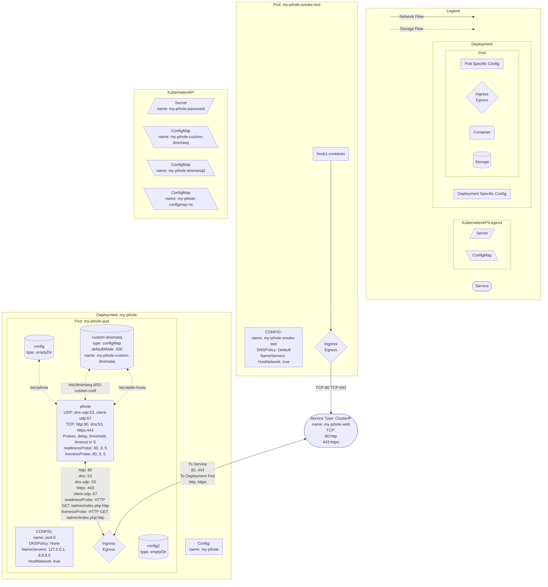

```mermaid
flowchart
subgraph Legend
    direction LR

    start1[ ] -->|Network Flow| stop1[ ]
    style start1 height:0px;
    style stop1 height:0px;
    start2[ ] -.->|Storage Flow| stop2[ ]
    style start2 height:0px;
    style stop2 height:0px; 
    subgraph KubernetesAPILegend
        direction LR
        Parallelogram[/ Secret /]
        ParallelogramAlt[\ ConfigMap \]
    end
    subgraph Deployment
        direction LR
        subgraph rootConfig[Deployment Specific Config]
        end
        subgraph Pod
        direction LR
        subgraph PodConfig[Pod Specific Config]
        end
        Proxy{Ingress
         Egress}
        Container(Container)
        Storage[( Storage )]
        end
    end
    Stadium([ Service ])
    end
my-pihole-smoke-test-proxy --TCP-80 TCP-443 --> my-pihole-web-service
subgraph my-pihole-smoke-test [Pod: my-pihole-smoke-test
]
direction BT
subgraph config-my-pihole-smoke-test [CONFIG:
name: my-pihole-smoke-test
DNSPolicy: Default
NameServers: 
HostNetwork: true
]
end
my-pihole-smoke-test-hook1-container(
hook1-container
)
my-pihole-smoke-test-proxy{"Ingress
Egress
"}
my-pihole-smoke-test-hook1-container --> my-pihole-smoke-test-proxy
end
subgraph my-pihole [Deployment: my-pihole]
subgraph my-pihole-config [Config:
name: my-pihole
]
end
subgraph my-pihole-pod-0 [Pod: my-pihole-pod]
direction BT
subgraph config-my-pihole-pod-0 [CONFIG:
name: pod-0
DNSPolicy: None
NameServers: 127.0.0.1, 8.8.8.0
HostNetwork: true
]
end
my-pihole-pod-0-pihole(
pihole
UDP: dns-udp:53, client-udp:67
TCP: http:80, dns:53, https:443
Probes: delay, threshold, timeout in S
readinessProbe: 60, 3, 5
livenessProbe: 60, 3, 5
)
my-pihole-pod-0-proxy{"Ingress
Egress
"}
my-pihole-pod-0-pihole <--http: 80
dns: 53
dns-udp: 53
https: 443
client-udp: 67
readinessProbe: HTTP GET /admin/index.php:http
livenessProbe: HTTP GET /admin/index.php:http
-->my-pihole-pod-0-proxy
my-pihole-pod-0-config[("config
type: emptyDir
")]
my-pihole-pod-0-config2[("config2
type: emptyDir
")]
my-pihole-pod-0-custom-dnsmasq[("custom-dnsmasq
type: configMap
defaultMode: 420
name: my-pihole-custom-dnsmasq")]
my-pihole-pod-0-config <-. "/etc/pihole" .-> my-pihole-pod-0-pihole

my-pihole-pod-0-custom-dnsmasq <-. "/etc/dnsmasq.d/02-custom.conf" .-> my-pihole-pod-0-pihole

my-pihole-pod-0-custom-dnsmasq <-. "/etc/addn-hosts" .-> my-pihole-pod-0-pihole
end
end
my-pihole-web-service([
Service Type: ClusterIP
name: my-pihole-web
TCP:
80:http
443:https
])
my-pihole-web-service <--To Service
80, 443
To Deployment Pod
http, https-->my-pihole-pod-0-proxy
subgraph KubernetesAPI [KubernetesAPI
]
my-pihole-password[/
Secret
name: my-pihole-password
/]
my-pihole-custom-dnsmasq[\
ConfigMap
name: my-pihole-custom-dnsmasq
\]
my-pihole-dnsmasq2[\
ConfigMap
name: my-pihole-dnsmasq2
\]
my-pihole-configmap-ns[\
ConfigMap
name: my-pihole-configmap-ns
\]
end

```